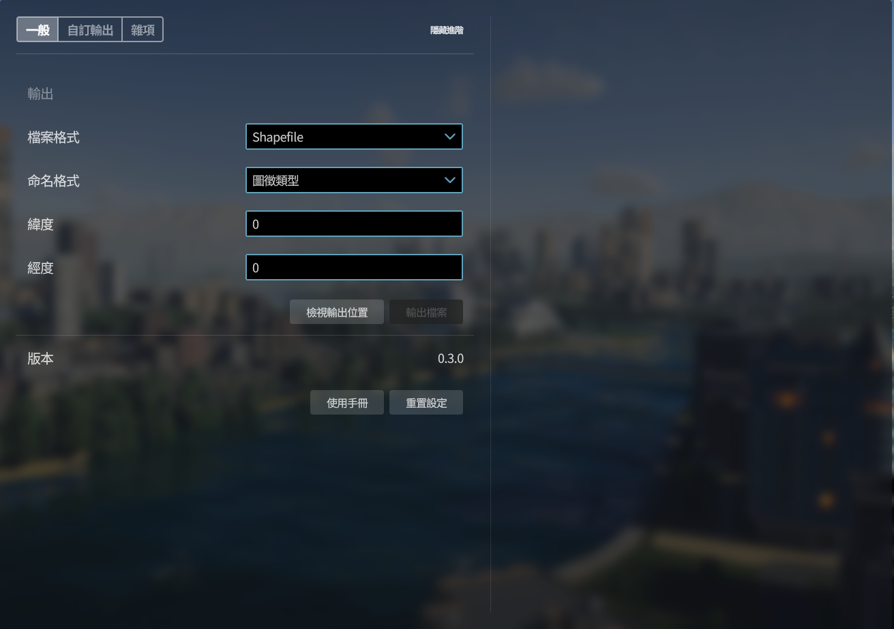
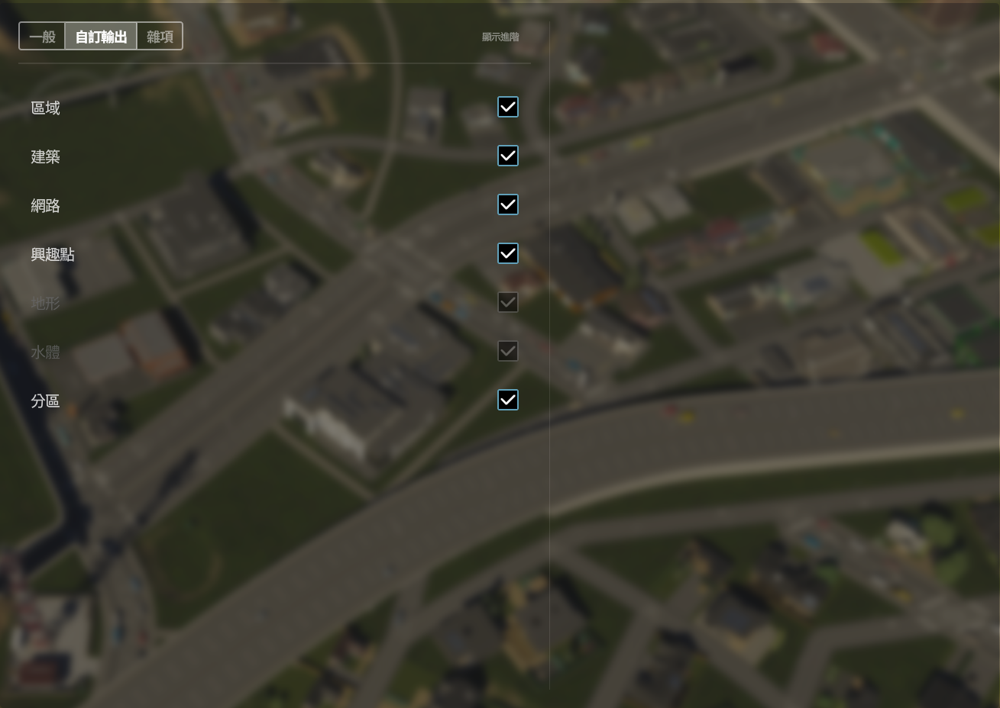
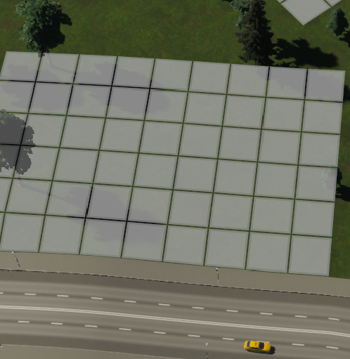
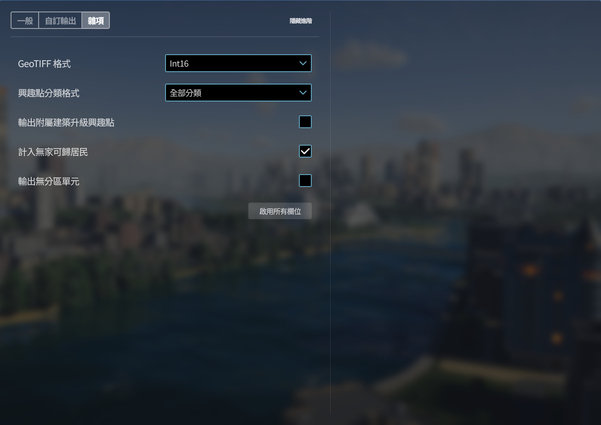

這是 Carto 使用手冊的首頁，請參閱各章節獲得更多資訊。**目前手冊適用於版本 0.3**。

This is the homepage of Carto’s user manual; please visit [[English version|Home]] here. **The current manual version is compatible with version 0.3**.

### 教學

正在尋找使用 Carto 與 QGIS、循序漸進地輸出地圖的教學嗎？你可以[[在這裡查看更多資訊|Tutorial-zh]]。

### 安裝

你可以在 [Paradox Mods](https://mods.paradoxplaza.com/mods/87428/Windows)，唯一的正式發佈管道上新增至遊玩集（Playset）或直接下載 Carto。當你啟動遊戲時，模組應該會被添加並載入至遊戲內。

### 章節

1. [一般分頁](#一般分頁)
2. [自訂輸出分頁](#自訂輸出分頁)
3. [雜項分頁](#雜項分頁)
4. [輸出後——再來呢？](#輸出後再來呢？)
5. [更新日誌](#更新日誌)

### 回饋及聯絡方式

你可以從 PDX 論壇的留言區、Cities: Skylines Modding Discord 伺服器與 Cities: Skylines Taiwan Assets Discord 伺服器聯繫我。若你想要開啟更深度的討論，或回報複雜的程式錯誤，我會建議你使用 GitHub 的議題區（Issue）或討論區（Discussion），這樣我能夠比較容易追蹤進度。

* 🌐 [Paradox 論壇](https://forum.paradoxplaza.com/forum/threads/carto.1699089/)
* 🛜 [Cities: Skylines Modding](https://discord.gg/HTav7ARPs2)－<u>僅限</u>英文
* 🛜 [Cities: Skylines Taiwan Assets](https://discord.gg/Gz4K66jT64)－中文為主
* 📧 [4alpelna4lve@gmail.com](mailto:4alpelna4lve@gmail.com)

## 一般分頁

Carto 的使用者介面位於**選項**中，你可以從遊戲主畫面上直接點擊附有齒輪圖示（⚙️）的**選項**按鈕，或是在遊玩中點擊畫面右上角的齒輪圖示，再點擊同樣帶有齒輪的**選項**按鈕找到這個分頁。抵達選項分頁後，請點擊畫面左側導覽列中的「Carto」，以進入 Carto 的設定介面。

*0.3 版本預設的一般分頁介面。*

一般分頁會是首先映入眼簾的介面，在這裡你可以選擇想要輸出的檔案格式、檔案命名格式與地圖中心的經緯度等。**了解應該使用哪一種檔案格式非常重要**，因為這會影響到能夠被輸出的項目種類。目前 Carto 支援輸出向量（Vector）格式的 GeoJSON 與 Shapefile，網格（Raster）格式則支援 GeoTIFF。以下提供三種格式的對照表：

| 檔案格式 | 副檔名 | 分類 | 可輸出的項目 | 特色 |
| :------ | ------ | ----| ----------- | -----|
| GeoJSON | `.json` | 向量 | 區域、建築、網路、興趣點、分區 | 結構簡單、輕量化，可以使用一般的文本編輯器編輯。適合少量資料的儲存與交換，但是缺乏對各圖徵（Feature）的編碼，導致搜尋與渲染效率不高。 |
| Shapefile | `.shp`、`.shx`、`.dbf` 等 | 向量 | 區域、建築、網路、興趣點、分區 | 二進位檔案不容易編輯，且需要數個附隨檔案（[Sidecar file](https://en.wikipedia.org/wiki/Sidecar_file)） 配合才能讀取。由於已對各圖徵編碼，搜尋與渲染效率較高。|
| GeoTIFF | `.tif` | 網格 | 地形、水體 | 儲存連續資料的影像檔案，可以用主流的媒體檢視器（如 Microsoft 相片）開啟。|

簡單來說，如果希望輸出**建築物**、**道路**、**軌道**、**小徑**、**興趣點**、**行政區邊界**、**地圖區塊邊界**或**分區單元**這類項目，你應該選擇向量的 GeoJSON 或 Shapefile；如果希望輸出**水域範圍**或**地形高度**，那麼你應該選擇網格的 GeoTIFF。

下一個選項是檔案的**命名格式**，預設的選項是「圖徵類別」，檔案名稱會根據其代表的項目命名，例如 `Area.shp`、`Building.json` 或 `Terrain.tif`。其他選項包括「城市名稱＋圖徵類別」與「地圖名稱＋圖徵類別」與「自訂格式」，前兩者分別在檔案名稱前方加上目前存檔的城市和地圖名稱，例如 `我的城市_Area.shp` 和 `我的地圖_Building.json`；最後一個選項則允許你自訂想要輸出的檔案名稱，請注意：當多個檔案名稱重複時，較早輸出的檔案會被先前輸出的檔案覆蓋掉。

> *由於已知的問題，若下拉式選單選擇「自訂格式」選項而未出現「自訂名稱」輸入框時，請點擊畫面中間上方的「顯示進階」按鈕兩下，強迫遊戲重新載入頁面。*

在「自訂名稱」輸入框中可以使用**變數**來顯示存檔的部份參數，以下是你所能使用的變數列表：

| 變數 | 說明 | 範例 |
| ----- | ----------- | ------- |
| `{Feature}` | 圖徵類型。 | `Area` |
| `{City}`    | 城市名稱。 | `My City` |
| `{Map}`     | 地圖名稱。 | `My Map` |
| `{Date}`    | 遵循 [ISO 8601](https://en.wikipedia.org/wiki/ISO_8601) 的遊戲內日期。 | `2027-04` |
| `{Time}`    | 使用 `HHmm` 格式的遊戲內時間。 | `1200` |

**經度**與**緯度**選項是重頭戲：只需要填入**地圖中心點**的經緯度座標（你可以使用 Google Maps 等線上地圖找出目標地點的經緯度），Carto 便可以將城市投影到地球上的絕大部分地點。當然如果你沒有特別想要投影到哪裡去，而是著重在觀看存檔的整體呈現效果，可以將經緯度設為 0 即可。

> 技術細節：Carto 使用的投影坐標系統（Projected Coordinate System，PCS）是 [UTM 投影](https://zh.wikipedia.org/wiki/通用横轴墨卡托投影)，大地基準（Datum）是 [WGS84](https://zh.wikipedia.org/zh-tw/世界大地测量系统)，其有效輸出範圍可以覆蓋到地球上絕大部分（北緯84度以南、南緯80度以北）的區域。Carto 輸出的 Shapefile 與 GeoTIFF 皆採用 UTM / WGS84 zone XXY 坐標系（EPSG: 326XX／327XX），GeoJSON 則是按 OGC 規範要求採用 WGS84 經緯度坐標系（EPSG: 4326）。

*右鍵點擊 Google Maps 的任意地點，會出現一個選單，其中最上面的那串數字即是緯度與經度。*

假如一切就緒，你就可以點擊「輸出檔案」按鈕，將遊戲內的物件輸出。輸出完成後（跳出輸出完成的視窗後），你可以點擊左側「檢視輸出位置」按鈕，快速前往輸出的資料夾位置（`C:\Users\<使用者名稱>\AppData\LocalLow\Colossal Order\Cities Skylines II\ModsData\Carto`）。由於 Carto 必須在遊戲載入後才能收集存檔的資訊，因此添加了**無法在未載入遊戲存檔或編輯器的情況下輸出**的防呆機制。

在這個分頁的最下方，除了有 Carto 的版本號與使用手冊連結外（就是你正在閱讀的這篇文章！），還有重置所有 Carto 設定的按鈕；為了防止誤觸，點擊後會再出現一個視窗，確認使用者真的想執行這個操作。

## 自訂輸出分頁

*0.3 版本預設的自訂輸出分頁介面。*

第二個介面是「自訂輸出分頁」，你可以在此自訂想要輸出的項目與內容。一般來說這個分頁的選項無法被同時更改，這是因為根據你在一般分頁中選擇的檔案格式不同，不適用目前檔案格式的圖徵類型會無法被勾選／反勾選。以下提供各種圖徵的對應表：

| 圖徵名稱 | 分類 | 內容 | 圖示 |
| ------- | ---- | ---- |:----:|
| 區域    | 向量 | 行政區、地圖區塊的邊界 |  |
| 建築    | 向量 | 建築物的碰撞範圍 |  |
| 網路    | 向量 | 道路、軌道、小徑的中心線與邊界 |  |
| 興趣點  | 向量 | 建築、站點等標記 |  |
| 地形    | 網格 | 地形高度 |  |
| 水體    | 網格 | 水體深度 |  |
| 分區    | 向量 | 使用分區的單元格子 |  |

對於一般使用而言，使用者只需要切換上表中的 6 個選項即可。而針對想進一步了解城市資訊的使用者，Carto 還提供了**進階模式**，讓使用者完全自訂每個圖徵之下的各個欄位啟用與關閉狀態。從畫面的中間上方點擊「顯示進階」按鈕，就可以開啟進階模式；新的選項會出現在「分區」選項下方，包括「選擇圖徵類型」下拉式選單與若干個選項。你可以在下拉式選單決定想進一步設定的圖徵，接著再到下方勾選／反勾選欄位。

> *由於已知的問題，建議使用者在「選擇圖徵類型」下拉式選單切換選項後，請點擊畫面中間上方的「顯示進階」按鈕兩下，強迫遊戲重新載入頁面與選項。*

*0.3 版本預設的進階輸出選項介面*

Carto 提供兩種類別的欄位，分別是「空間」與「非空間」兩種。前者儲存了目前選擇圖徵的空間資料，**也就是它們的形狀**；後者儲存了目前選擇圖徵的屬性資料，**換句話說就是它們的統計資料**。目前 Carto 要求使用者對於每一種圖徵都必須選擇至少一項空間欄位，而非空間欄位則無特別限制（因為 Carto 總是會輸出物件的名稱欄位）。以下列出 Carto 支援的所有欄位類別：

*解釋空間欄位與非空間欄位的插圖*

### 空間欄位

目前 Carto 共有 7 種空間欄位。

#### 中心線 Centerline

* 適用版本：0.1 +
* 適用圖徵：`網路`
* 幾何類型：向量（線段）
* 說明：網路的中心線，適合用在分析路網的用途上。

#### 深度 Depth

* 適用版本：0.1 +
* 適用圖徵：`水體`
* 幾何類型：網格（7m × 7m）
* 說明：水體的深度。陸地區域（深度為 0）根據 [GeoTIFF 格式](#GeoTIFF格式)不同，被替換成相對應的無資料值（No data value）。

#### 邊緣 Edge

* 適用版本：0.1 +
* 適用圖徵：`區域`、`建築`、`網路`、`分區`
* 幾何類型：向量（多邊形）
* 說明：圖徵的邊緣，是最泛用的空間欄位。
  * 對於 `建築` 圖徵而言，這表示的是**建築的碰撞範圍**（原版遊戲內會提示物件重疊的區域）
  * 對於 `網路` 圖徵而言，這表示的是**道路用地的範圍**。**注意**：目前網路的邊緣輸出後可能會出現無效的圖形，建議使用 GIS 軟體的「修正幾何」功能處理資料。

#### 高程 Elevation

* 適用版本：0.1 +
* 適用圖徵：`地形`
* 幾何類型：網格（3.5m × 3.5m）
* 說明：地形的高程。
  * 注意這**不是**海拔高度，而是從遊戲內的原點計算的高度落差。

#### 位置 Location

* 適用版本：0.3 +
* 適用圖徵：`興趣點`
* 幾何類型：向量（點）
* 說明：圖徵所在的地點。

#### 世界深度 World Depth

* 適用版本：0.2.1 +
* 適用圖徵：`水體`
* 幾何類型：網格（14m × 14m）
* 說明：水體的深度，但是包括了可遊玩區域**以外**的範圍（即「世界」）。
  * 由於遊戲可遊玩區域外的水域是直接由海平面高程減去地形高程獲得，因此在可遊玩區域內建議使用[深度](#深度-depth)欄位的資料，以避免出現窪地被誤認為水域的情況。

#### 世界高程 World Elevation

* 適用版本：0.2.1 +
* 適用圖徵：`地形`
* 幾何類型：網格（14m × 14m）
* 說明：地形的高程，但是包括了可遊玩區域**以外**的範圍（即「世界」）。
  * 由於遊戲不會更新世界高程資料，因此建議僅在可遊玩區域外運用此欄位，可遊玩區域內使用[高程](#高程-elevation)欄位。

### 非空間欄位

目前 Carto 共有 23 + 1 種非空間欄位；網格類型的資料**不會**有非空間欄位。

#### 地址 Address

* 適用版本：0.2 +
* 適用圖徵：`建築`、`興趣點`
* 欄位類型：複合（字串、整數）
* 說明：遊戲內建築的編碼。
  * 此欄位為**複合欄位**，輸出後會變成三個欄位：
    * GeoJSON：`Address_District`（行政區）、`Address_Street`（道路）、`Address_Number`（門牌號碼）
    * Shapefile：`Addr_dist`（行政區）、`Addr_strt`（道路）、`Addr_nmbr`（門牌號碼）
    * 在 0.2.5 更新以前，這些欄位分別為：`Address.District`、`Address.Street`、`Address.Number`、`Addr.dist`、`Addr.strt`、`Addr.nmbr`
  * 不屬於任何行政區的建築物會被歸類為「（未建制地區）」，沒有門牌號碼的建築預設為 0 號。

#### 面積 Area

* 適用版本：0.1 +
* 適用圖徵：`區域`
* 欄位類型：浮點數
* 說明：物件的占地面積，單位為**平方公尺**（m2）。

#### 資產 Asset

* 適用版本：0.1 +
* 適用圖徵：`建築`、`網路`
* 欄位類型：字串
* 說明：資產的名稱。

#### 品牌 Brand

* 適用版本：0.2 +
* 適用圖徵：`建築`
* 欄位類型：字串
* 說明：租下該建築的企業名稱。

#### 分類 Category

* 適用版本：0.1 +
* 適用圖徵：`建築`、`網路`、`興趣點`
* 欄位類型：字串
* 說明：物件的進一步分類。
  * 詳細的分類請參閱[[分類列表|Category-zh]]。
  * 一個圖徵有可能擁有複數個分類，例如垃圾焚燒廠的分類是 `Public, Power, Waste`，而鋪設路面電車的四線道路的分類則是 `Medium, Tram`；分類之間會以逗號（`,`）連接。

#### 中心 Center

* 適用版本：0.1 +
* 適用圖徵：`區域`
* 欄位類型：複合（浮點數）
* 說明：區域的中心座標。
  * 此欄位為**複合欄位**，輸出後會變成三個欄位：
    * GeoJSON、Shapefile：`Center_x`（X 座標）、`Center_y`（Y 座標）、`Center_z`（Z 座標）
    * 在 0.2.5 更新以前，這些欄位分別為：`Center.x`、`Center.y`、`Center.z`
  * 此欄位輸出的坐標為遊戲內的坐標系，原點位於地圖中心。

#### 顏色 Color

* 適用版本：0.1.1 +
* 適用圖徵：`分區`
* 欄位類型：字串
* 說明：遊戲內分區顯示的顏色。
  * 開啟[使用 Zone Color Changer 的顏色](#使用ZoneColorChanger的顏色)選項時，輸出的顏色會變成當下 Zone Color Changer 模組設定的顏色。

#### 公司 Company

* 適用版本：0.2.2 +
* 適用圖徵：`區域`
* 欄位類型：整數
* 說明：區域內的公司數量。
  * 即使是同一間企業旗下的商店，Carto 依舊會把分公司當作獨立的公司計算。
  * Carto 不會計算地圖區塊內的公司數量。

#### 密度 Density

* 適用版本：0.1.1 +
* 適用圖徵：`分區`
* 欄位類型：字串
* 說明：分區的發展強度或是聚集密度。
  * 分區圖徵的密度如下：
    * `Generic` 通用（無分類）
    * `Low` 低密度
    * `Medium` 中密度
    * `High` 高密度

#### 方向 Direction

* 適用版本：0.1 +
* 適用圖徵：`網路`
* 欄位類型：字串
* 說明：載具在網路上的行駛方向。
  * 網路圖徵的方向如下：
    * `Both` 雙向
    * `Forward` 順向（起點→終點）
    * `Backward` 逆向（終點→起點）

#### 員工 Employee

* 適用版本：0.2 +
* 適用圖徵：`區域`、`建築`
* 欄位類型：整數
* 說明：區域內的受雇員工數量。
  * Carto 不會計算地圖區塊內的員工數量。

#### 形式 Form

* 適用版本：0.1 +
* 適用圖徵：`網路`
* 欄位類型：字串
* 說明：網路的外觀形式。
  * 網路圖徵的形式如下：
    * `Normal` 一般（平面）
    * `Elevated` 高架
    * `Tunnel` 隧道

#### 高程 Height

* 適用版本：0.1 +
* 適用圖徵：`網路`
* 欄位類型：浮點數
* 說明：網路的平均高程，單位為**公尺**（m）。

#### 家庭 Household

* 適用版本：0.2 +
* 適用圖徵：`區域`、`建築`
* 欄位類型：整數
* 說明：區域內的家庭數量。
  * 開啟[計入無家可歸居民](#計入無家可歸居民)選項時，會將居住在公園的無家可歸家庭計入該區家庭數量。
  * Carto 不會計算地圖區塊內的家庭數量。

#### 長度 Length

* 適用版本：0.1 +
* 適用圖徵：`網路`
* 欄位類型：浮點數
* 說明：網路的長度，單位為**公尺**（m）。

#### 等級 Level

* 適用版本：0.2 +
* 適用圖徵：`建築`
* 欄位類型：整數
* 說明：建築的升級進度。

#### 名稱 Name

* 適用版本：0.1 +
* 適用圖徵：`區域`、`建築`、`網路`、`興趣點`、`分區`
* 欄位類型：字串
* 說明：物件的名稱。
  * 此欄位為預設欄位，使用者**無法取消輸出**。

#### 物體 Object

* 適用版本：0.1 +
* 適用圖徵：`區域`、`建築`、`網路`、`興趣點`、`分區`
* 欄位類型：字串
* 說明：Carto 對遊戲內物體的分類。
  * 所有物體：
    * `Building` 建築
    * `District` 行政區
    * `Map Tile` 地圖區塊
    * `Pathway` 小徑
    * `Road` 道路
    * `Track` 軌道
    * `Zoning` 分區

#### 產品 Product

* 適用版本：0.2 +
* 適用圖徵：`建築`
* 欄位類型：字串
* 說明：建築物生產或銷售的商品名稱。

#### 居民 Resident

* 適用版本：0.2 +
* 適用圖徵：`區域`、`建築`
* 欄位類型：整數
* 說明：區域內的居民數量。
  * 開啟[計入無家可歸居民](#計入無家可歸居民)選項時，會將居住在公園的無家可歸者計入該區居民數量。
  * Carto 不會計算地圖區塊內的居民數量。

#### 主題 Theme

* 適用版本：0.1.1 +
* 適用圖徵：`建築`、`分區`
* 欄位類型：字串
* 說明：資產的主題風格。

#### 解鎖 Unlocked

* 適用版本：0.1 +
* 適用圖徵：`區域`
* 欄位類型：布林／整數
* 說明：地圖區塊的購買狀態。
  * 輸出為 GeoJSON 時為布林，輸出為 Shapefile 時為整數（0 / 1）。

#### 寬度 Width

* 適用版本：0.1 +
* 適用圖徵：`網路`
* 欄位類型：浮點數
* 說明：網路的寬度，單位為**公尺**（m）。

#### 分區 Zoning

* 適用版本：0.2 +
* 適用圖徵：`建築`、`分區`
* 欄位類型：字串
* 說明：土地的發展用途。
  * 所有分區：
    * `None` 無分區
    * `Residential` 住宅
    * `Commercial` 商業
    * `Industrial` 工業
    * `Office` 辦公

  * 一個圖徵有可能擁有複數個分區，例如歐式中密度混合住宅區的分區是 `Residential, Commercial`；分類之間會以逗號（`,`）連接。

## 雜項分頁

*0.3 版本預設的雜項分頁介面。*

最後一個分頁是雜項分頁。第一個是 **GeoTIFF 格式**選項，一共有三種模式可供選擇，分別是「Int16」、「Norm16」和「Float32」。三者的對照表如下：

|  簡稱  |       全稱        | 說明 |
| ------ | ---------------- | ---- |
| Int16  |16位元整數         | 預設的選項，以整數表示數值大小，提供合理的檔案大小與可接受的資訊失真。|
| Norm16 |16位元標準化整數   | 將 Int16 的資料標準化的格式，**可作為地圖編輯器的高度圖使用**。      |
| Float32|32位元浮點數       | 提供精度可達小數點後數位的資料，但是 **檔案大小為 Int16 的兩倍**。   |

第二個是**興趣點分類格式**選項，使用者可以選擇「所有分類」或是「單一分類」，前者表示分類欄位將會輸出所有適合的分類，而後者僅會輸出最佳分類。預設為「所有分類」。

第三個是**輸出附屬建築升級興趣點**選項，使用者可以決定是否獨立輸出附屬建築的興趣點。預設為關閉。

第四個是**計入無家可歸居民**選項，當開啟此選項時，無家可歸且**住在公園**的市民會被計入到對應的[居民](#居民-resident)與[家庭](#家庭-household)欄位中。下表是 Carto 進行人口統計時參考的項目：

| 欄位       | 一般市民 | 無家可歸者      | 外來人口（旅客／過境／移工）| 說明 |
| --------- | ---------| ---------------|--------------------------|------|
| 家庭／居民 | ✅       | ⚠️僅居於公園者 | ❌                       |由於不居住在公園的無家可歸者相當於沒有戶籍，因此可被排除。|
| 員工      | ✅       | ✅            | ✅                       |無家可歸者與外來的移工皆會在城市中工作，因此應計入。|

*假設啟用「計入無家可歸居民」時，Carto 的計算方式*

第五個是**輸出無分區單元**選項，當開啟此選項時，Carto 會輸出所有的分區單元格。由於隨著城市發展越大，出現無分區格子的頻率會越高，使得檔案虛胖；因此對於想節省空間的使用者，建議可以關閉此選項。

第六個是**使用 Zone Color Changer 的顏色**選項，會在遊戲同時載入 Carto 與 [Zone Color Changer](https://mods.paradoxplaza.com/mods/81568/Windows) 模組時出現。當開啟此選項時，Carto 輸出的[顏色](#顏色-color)欄位將採用 Zone Color Changer 設定的顏色。

最後是「啟用所有欄位」按鈕，顧名思義就是啟用「每個圖徵的所有欄位」。

## 輸出後——再來呢？

那麼在你輸出完之後，要如何檢視與運用這些資料呢？以下根據不同的情境，提供你一些資源與靈感：

### 使用 GIS 軟體

這是 Carto 推薦的方案，因為它們不僅是提供你檢視、編輯資料的強大平臺，還可以進行深入的地理分析。以下列出部分可以讀取這些地理空間檔案的 GIS 軟體：

* [QGIS](https://www.qgis.org/)：開源免費的 GIS 軟體，還有眾多由志願者開發並維護的插件。中文入門教學可以參考中研院人社中心的 [QGIS及Open Geodata資源網](https://gis.rchss.sinica.edu.tw/qgis/)、臺大地理系溫在弘教授的 [QGIS 人口地圖繪製教學網](https://wenlab501.github.io/tutorial/qgis_tutor/)與黃敏郎的[同名 YouTube 頻道](https://www.youtube.com/@huangyoshi/videos)等（推薦）。 
  * 正在尋找使用 Carto 與 QGIS、循序漸進地輸出地圖的教學嗎？你可以[[在這裡查看更多資訊|Tutorial-zh]]。
* [ArcGIS Pro](https://pro.arcgis.com/en/pro-app/latest/get-started/get-started.htm)：由 Esri 開發的付費軟體，相較於它的線上版本（ArcGIS Online），安裝在電腦上的版本可以執行的功能更加多元，而且官方提供中文教學（如果你有帳號的話，推薦）。

### 使用線上檢視器

對於想要看到輸出效果，但無法使用 GIS 軟體的使用者而言，這會是你檢視這些空間資料的主要途徑。以下列出部分可以檢視這些地理空間檔案的網站：

* [mapshaper](https://mapshaper.org/)：可以檢視 GeoJSON 和 Shapefile，讀取速度快，還可以重疊圖層（推薦）。
* [geojson.io](https://geojson.io/)：可以檢視 GeoJSON，同時還可以編輯檔案與上色等（推薦）。
* [Survey Transfer](https://app.surveytransfer.net/)：可以檢視 GeoJSON、Shapefile 與 GeoTIFF，**但是需要註冊帳號、14日免費試用**（不推薦）。
* [ArcGIS Online](https://maps.arcgis.com/apps/mapviewer/index.html)：可以檢視 GeoJSON、Shapefile 與 GeoTIFF，授權夭壽貴，除非你剛好有帳號可以使用，不然免費使用者無法上傳地理空間資料（不推薦）。

### 使用程式套件

如果你有與其他軟體或程式語言整合的需求，可以考慮使用各程式語言對應的相關套件處理。以下列出部分可以處理地理空間資料的套件：

* [GDAL](https://github.com/OSGeo/gdal)：由 OGC 維護的地理空間資料轉檔軟體，是這邊列出的不少軟體與套件的基底之一。
* [GeoPandas](https://github.com/geopandas/geopandas)：Python 套件，由其名稱不難看出，它與 Pandas 存取資料的方式相近，都是用類似 `DataFrame` 類別（`GeoDataFrame`）來存取地理空間資料。
* [sf](https://github.com/r-spatial/sf)：R 套件，同樣使用似 `data.frame` 的類別（`sf`，simple feature）來存取資料。

你可以在 [Awesome GIS](https://github.com/sshuair/awesome-gis) 中找到更多關於處理地理空間資料的軟體與套件資訊。

### 給我一些範例！

沒問題，這邊提供你一些靈感與範例：

*一張經典的街道圖，使用了區域、建築、網路（邊緣）、興趣點、地形與水體圖徵。*

*分析城市內飲料產業的資訊，使用了區域、建築與水體圖徵。*

*你可以使用建築、網路、分區等圖徵來輔助相片的空間對位。*

## 更新日誌

### 0.3

* 現在 Carto 可以輸出興趣點（Point of interests，POI）圖徵，並包含以下欄位：
  * 一個**空間欄位**：<u>位置</u>。
  * 兩個**非空間欄位**：地址 與 分類。
* 新增「興趣點分類格式」選項（雜項 > 興趣點分類格式），使用者可以選擇「所有分類」或是「單一分類」，前者表示分類欄位將會輸出所有適合的分類，而後者僅會輸出最佳分類。預設為「所有分類」。
* 新增「輸出附屬建築升級興趣點」選項（選項 > 輸出附屬建築升級興趣點），使用者可以決定是否獨立輸出附屬建築的興趣點。預設為關閉。
* 新增三個 QGIS 預製樣式（Plan、Street 和 Topo），使用者可以在 `ModsData\Carto\Styles` 目錄中找到他們。

註記：<u>底線</u>表示為新欄位。

### 0.2.5

* 修正 ArcGIS 無法讀取包含句點（.）欄位檔案的問題，現在這些欄位的分隔符號被替換為底線（_）。［由 [load-ing](https://forum.paradoxplaza.com/forum/members/load-ing.1818892/) 回報］
* 新增兩個可用於自訂名稱格式的變數：{Date} 和 {Time} ；前者表示遊戲內日期，後者表示遊戲內時間。

### 0.2.4

* 修正網路圖徵的邊緣欄位無法被 ArcGIS 等軟體讀取的問題。［由 [Cities Skylines 光光](https://www.youtube.com/@CS_LightLight) 回報］
* 修正部分小徑末端連接道路處的鋸齒。
* 嘗試修正網路圖徵的邊緣欄位輸出含有無效多邊形的錯誤，當道路以極其尖銳的角度相連的情況下，仍有可能產生微型（< 1公尺）的自我相交（Self-intersection）錯誤。

### 0.2.3

* 修正當輸出時存在至少一個「無法找到符合對象實體」的已選取圖徵時，輸出流程會被終止的錯誤。這些圖徵現在會被忽略，並且使用者會在輸出完成時被告知忽略的檔案。［由 [@Allegretic](https://mods.paradoxplaza.com/authors/Allegretic) 回報］

### 0.2.2

* 區域圖徵新增四個**非空間**欄位，包括：<u>公司</u>、員工、家庭 與 居民。
* 建築圖徵新增一個**非空間**欄位：主題。
* 新增「使用手冊」按鈕（一般 > 使用手冊），使用者可以從瀏覽器開啟此頁面。
* 新增「計入無家可歸居民」選項（雜項 > 計入無家可歸居民），使用者可以選擇是否在計算居民或家庭欄位時排除無家可歸者；預設開啟。
* 修正 `ModsData\Carto\Shapefile` 資料夾不存在時，無法輸出的錯誤。
* 移除 `*.prj` 檔案開頭的 UTF-8 BOM 與排版，使 ArcGIS Pro 可以正確辨識 Shapefile 的座標系統。
* 添加輸出成功視窗，提醒使用者已經輸出完成。
* 添加對以 Road Builder 模組製作的網路的支援。

註記：<u>底線</u>表示為新欄位。

### 0.2.1

* 現在 Carto 可以輸出可遊玩區域之外的世界高度圖（World Heightmap）。
  * 地形圖徵新增一個**空間**欄位：世界高程。
  * 水體圖徵新增一個**空間**欄位：世界深度。
* 新增「GeoTIFF 格式」選項（雜項 > GeoTIFF 格式），使用者可以選擇要將 GeoTIFF 輸出為 Int16（16位元整數）、Norm16 *（16位元標準化整數）或 Float32（32位元浮點數）格式；預設為 Int16。
* 重寫 Shapefile 的輸出模式。現在 dBASE 檔案中的字串欄位長度不再是固定的254位元組，而是根據所有資料轉換之位元組最長者計算，平均可以減少 80% 的檔案大小。
* 重新整理選項頁面。一般分頁中增加了「版本」資訊，而原先在一般分頁的「啟用所有欄位」按鈕被移至雜項分頁。
* 添加輸出警告視窗，能夠協助使用者排除遇到的問題。
* 添加簡體中文（zh-HANS）與繁體中文（zh-HANT）翻譯。

註記：Norm16 實際上是 UInt16 格式，此處為配合遊戲內程式碼稱呼而沿襲此用法。

### 0.2

* 現在 Carto 可以輸出建築圖徵，並且可以從自訂輸出分頁中調整這些欄位的狀態。
  * 建築圖徵適用的**空間**欄位包括：邊緣。
  * 建築圖徵適用的**非空間**欄位包括：<u>地址</u>、資產、<u>品牌</u>、分類、<u>員工</u>、<u>家庭</u>、<u>等級</u>、物體、<u>產品</u>、<u>居民</u>與<u>分區</u>。
* 分區的「分類」欄位現在被稱為「分區」。
* 部分通用類別被集中遷移至的 Carto.Domain 與 Carto.Utils.ExportUtils 命名空間。

註記：<u>底線</u>表示為新欄位。

### 0.1.2

* 現在 Carto 可以輸出分區的空間欄位：邊緣。
  * Carto.Systems.ZoningSystem.GetZoningProperties() 現在整合到了 Carto.Utils.ExportUtils 內。
  * 移除遊戲載入後會自動呼叫前述方法的行為。
* 修正當 Zone Color Changer 模組啟用時，無法輸出遊戲內原始分區顏色的錯誤。
* 新增雜項分頁，並且添加了兩個設定：
  * 新增「輸出無分區單元」選項（雜項 > 輸出無分區單元），使用者可以選擇不輸出沒有任何分區的單元以降低檔案大小；預設關閉。
  * 新增「使用 Zone Color Changer 的顏色」選項（雜項 > 使用 Zone Color Changer 的顏色），使用者可以選擇使用在 Zone Color Changer 中設定的顏色；預設開啟。

### 0.1.1

* 現在 Carto 可以輸出分區的非空間欄位，包括：分類、<u>顏色</u>、<u>密度</u>、物體與<u>主題</u>。
  * 目前當載入遊戲時便會自動呼叫 Carto.Systems.ZoningSystem.GetZoningProperties() 方法，會在日誌（Log）中留下分區的資訊。
  * 目前無法輸出分區的空間欄位。
* 使用 System.Reflection 以整合 Zone Color Changer 模組中使用者設定的分區顏色資訊。

註記：<u>底線</u>表示為新欄位。

### 0.1

* Carto 的第一個公開儲存庫版本。
