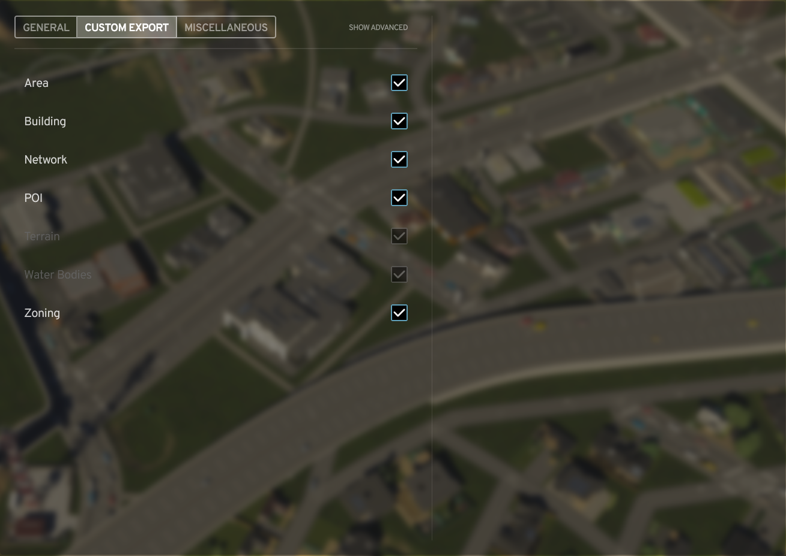

# Carto user manual homepage

See each [chapter](#chapters) for more information. **This manual is compatible with version 0.3**.

這是 Carto 使用手冊的首頁，[[中文版說明|Home-zh]]請由此進；**目前手冊適用於版本 0.3**。

## Tutorial

Looking for a step-by-step tutorial to export maps with Carto and QGIS? [[Visit the tutorial here|Tutorial]].

## Installation

Add the mod on [Paradox Mods](https://mods.paradoxplaza.com/mods/87428/Windows), which is the only official distribution channel. When you launch the game, the mod should automatically load.

## Chapters

1. [General Tab](#general-tab)
2. [Custom Export Tab](#custom-export-tab)
3. [Miscellaneous Tab](#miscellaneous-tab)
4. [Post-export: What’s Next?](#post-export-whats-next)
5. [Changelog](#changelog)

## Feedback and Contacts

You can reach me at:

* 🌐 [Paradox Forum](https://forum.paradoxplaza.com/forum/threads/carto.1699089/)
* 🛜 [Cities: Skylines Modding](https://discord.gg/HTav7ARPs2) - *English ONLY*
* 🛜 [Cities: Skylines Taiwan Assets](https://discord.gg/Gz4K66jT64) - *Chinese preferred*
* 📧 [4alpelna4lve@gmail.com](mailto:4alpelna4lve@gmail.com)

 If you need to start a more in-depth discussion or report complicated bugs, use GitHub’s issues or discussions, as it isn’t easy to track them between threads.

## General Tab

To open the Carto UI, Select **Options** (⚙️) &rarr; **Carto**. You can also search for “Carto” in the navigation bar on the left, then click the text to access settings.

### General Tab interface

The first interface that comes into your view is the General Tab. Here you can select the exported files’ format, naming conventions, the coordinates of the map center, etc.

> **IMPORTANT**: The file format you select affects the variety of the items that can be exported. Here’s a table to help you choose from these formats.

| File Format | Extension | Category | Supported Feature Types | Description | Good for displaying |
| ----------- | --------- | ---------| ----------------------- | ------------| ---|
| GeoJSON     |  `.json`  |  Vector  | Area, Building, Network, POI & Zoning | The format is simple and lightweight and can be edited using a general text editor. It is suitable for the storage and the exchange of small amounts of data, but lacking indexing on each feature results in low search and rendering efficiency. | Buildings, roads, tracks, pathways, points of interest (POIs), district borders, map tile borders, or zoning cells|
| Shapefile   | `.shp`, `.shx`, `.dbf`, etc. | Vector | Area, Building, Network, POI & Zoning | The format is not easy to edit as it is encoded in binary format, and reading such format requires multiple [sidecar files](https://en.wikipedia.org/wiki/Sidecar_file). However, the efficiency of reading and rendering is higher since the features are pre-indexed. | Buildings, roads, tracks, pathways, points of interest (POIs), district borders, map tile borders, or zoning cells|
| GeoTIFF     | `.tif`    | Raster   | Terrain, Water Bodies | This is the image format that stores sequential data into pixels. You can open the file with major media viewers (such as Microsoft Photos). | Water bodies or terrain heights|

#### Naming format

The default option is the “Feature Type.” Other options include “City Name + Feature Type,” “Map Name + Feature Type,” and “Custom.” The first two add the map name and the city name in the current save respectively, such as `My City_Area.shp` or `My Map_Building.json`. The last one allows you to customize the file name, but you should be aware that only one file remains when multiple files are exported under the same name (The file exported previously will be overwritten by the file exported later.)

> Due to a known issue, the “Custom Name” input text box doesn’t appear when the option “Custom Name” is selected in the dropdown. Please double-click the “Show Advanced” button in the upper middle of the screen, so as to force the game to reload the user interface.

You can use *tokens* in the **Custom Name** field to display several save parameters:

| Token | Description | Example |
| ----- | ----------- | ------- |
| `{Feature}` | The feature type. | `Area` |
| `{City}`    | The name of the city. | `My City` |
| `{Map}`     | The name of the map. | `My Map` |
| `{Date}`    | The in-game date that follows [ISO 8601](https://en.wikipedia.org/wiki/ISO_8601) standard. | `2027-04` |
| `{Time}`    | The in-game time using `HHmm` format. | `1200` |

> **IMPORTANT**: Tokens are case-sensitive.

The **latitude** and the **longitude** options are the highlight: Carto can project your city to most places on Earth as long as you provide a valid coordinate. You can use online map services like Google Maps to retrieve the coordinates of your target location, as shown in the image below. Of course, if there are no places you particularly want to project to, you can set both of them to zero.

> Technical Details: The Projected Coordinate System (PCS) Carto uses is the [Universal Transverse Mercator](https://en.wikipedia.org/wiki/Universal_Transverse_Mercator_coordinate_system) (UTM), and the datum is [WGS84](https://en.wikipedia.org/wiki/World_Geodetic_System#WGS_84). UTM projection is applicable to any place on Earth as long as they are between 84°N and 80°S. Carto always exports files into UTM / WGS84 zone XXY (EPSG: 326XX / 327XX) projections except for GeoJSONs, since the OGC specification asks the software to treat the value in the spatial fields of GeoJSONs as EPSG: 4326 coordinates.

*Right-click any location on Google Maps, and a menu with the coordinates information will show up.*

If everything is ready, you can click the “Export Files” button to export in-game objects. Once the export finishes (A dialog will inform you that the files are exported successfully), you can click the “Open Export Directory” button on the left to access the output folder (`C:\Users\<UserName>\AppData\LocalLow\Colossal Order\Cities Skylines II\ModsData\Carto`) quickly. Since Carto can only collect the relevant data after a save is loaded or an editor is launched, **the “Export Files” button will remain disabled until the condition mentioned is met**.

In addition to the Version and the User Manual (the article you are reading now) button, the “Reset Mod Settings” button is also located at the bottom of the tab. To prevent accidental clicks, a confirmation dialog will appear after the user clicks on the button.

## Custom Export Tab

*The default interface of the Custom Export Tab*

The second tab is the Custom Export Tab, where you can customize the contents and the items you want to export. Normally the options in this tab can’t be changed at once, because the options not applicable to the current selected file format will be disabled. Here’s a table of available features provided by Carto:

| Feature Name | Category | Contents | Image |
| ------------ | -------- | -------- |:-----:|
| Area         | Vector   | The boundaries of districts and map tiles |  |
| Building     | Vector   | The collision area of buildings |  |
| Network      | Vector   | The centerline and the edge of roads, tracks, and pathways |  |
| POI (Point of Interest) | Vector   | The location of the buildings or transportation stops’ markers |  |
| Terrain      | Raster   | The terrain elevation |  |
| Water Bodies | Raster   | The water depths |  |
| Zoning       | Vector   | The zoning cells (small blocks) |  |

Users only need to switch between the six options in the table above under general circumstances. For the users who want to have all controls over the exported fields, Carto also provides them the **Advanced Mode** to play with. To enable the advanced mode, users just need to click on the “Show Advanced” button. New options, including a dropdown selector and several checkboxes, will appear at the bottom of the “Zoning” option. You can configure each feature type’s fields, by selecting the feature type in the “Select Feature” dropdown first, then manually toggling the fields you want to change.

> *Due to a known issue, users are advised to double-click the “Show Advanced” button after switching options in the “Select Feature” dropdown to force the game to reload the user interface.*

*Default interface of the advanced view in the Custom Export Tab*

Carto provides two types of fields, namely “spatial” and “non-spatial.” The former stores the spatial data of the currently selected features, that is, **their shapes**; the latter stores the attribute data of the currently selected features, in other words, **their statistical data**. Currently, Carto requires users to select at least one spatial field for each feature, while there are no restrictions on non-spatial fields (because Carto always outputs the Name field of the object). Followings are all fields supported by Carto:

*Illustration of the relationship between spatial and non-spatial fields*

### Spatial Fields

Carto currently supports 7 spatial fields.

#### Centerline

* Version: 0.1 +
* Feature: `Network`
* Geometry: Vector (Lines)
* Description: The centerline of the network is widely used in network analysis.

#### Depth

* Version: 0.1 +
* Feature: `Water Bodies`
* Geometry: Raster (7m × 7m)
* Description: The depth of the water bodies. Depending on the [GeoTIFF Format](#geotiff-format) you choose, the land part (depth = 0) will be replaced by different nodata values.

#### Edge

* Version: 0.1 +
* Feature: `Area`, `Building`, `Network` & `Zoning`
* Geometry: Vector (Polygons)
* Description: The outline of the features.
  * For `Building` features, this represents **the collision area of the building**.
  * For `Network` features, this represents **the surface area of the networks**. **Caution**: The exported network edges might have invalid geometries; you can use the fix geometry function in GIS software to handle the data at the moment.

#### Elevation

* Version: 0.1 +
* Feature: `Terrain`
* Geometry: Raster (3.5m × 3.5m)
* Description: The elevation of the terrain.
  * Note that this is **NOT** the distance between terrain and the sea level, but the distance between that and the in-game origin.

#### Location

* Version: 0.3 +
* Feature: `POI`
* Geometry: Vector (Points)
* Description: The position of the feature.

#### World Depth

* Version: 0.2.1 +
* Feature: `Water Bodies`
* Geometry: Raster (14m × 14m)
* Description: The depth of the water bodies with the region outside of the playable area (world) included.
  * Since the depth of the dummy water bodies outside of the playable area is obtained by the difference between the sea level and the terrain, you should only use the value outside of the playable area, in case you want to merge it with the [Depth](#depth) field.

#### World Elevation

* Version: 0.2.1 +
* Feature: `Terrain`
* Geometry: Raster (14m × 14m)
* Description: The elevation of the terrain with the region outside of the playable area (world) included.
  * Since the terrain data from the world heightmap will not be updated by the game, you should only use the value outside of the playable area, in case you want to merge it with the [Elevation](#elevation) field.

### Non-Spatial Fields

Carto currently supports 23 + 1 non-spatial fields. GeoTIFF **DOESN’T** have non-spatial fields.

#### Address

* Verison: 0.2 +
* Feature: `Building` & `POI`
* Data Type: Composite (String, Integer)
* Description: The in-game building identifier.
  * This field is a **composite field**. Three fields will be exported:
    * GeoJSON: `Address_District`, `Address_Street` & `Address_Number`.
    * Shapefile: `Addr_dist`, `Addr_strt` & `Addr_nmbr`.
    * Before 0.2.5 update, these fields had different names: `Address.District`, `Address.Street`, `Address.Number`, `Addr.dist`, `Addr.strt` & `Addr.nmbr`.
  * The buildings will be classified as “(Unincorporated Area)” if they do not belong to any districts. The buildings without a house number will receive the default number, 0.

#### Area

* Version: 0.1 +
* Feature: `Area`
* Data Type: Float
* Description: The extent of the object in **square meters** (m2).

#### Asset

* Version: 0.1 +
* Feature: `Building` & `Network`
* Data Type: String
* Description: The title of the asset.

#### Brand

* Version: 0.2 +
* Feature: `Building`
* Data Type: String
* Description: The name of the enterprise that rents the property.

#### Category

* Version: 0.1 +
* Feature: `Building`, `Network` & `POI`
* Data Type: String
* Description: The sub-division of the in-game objects.
  * Please refer to the [[category list|Category]] for a detailed list of all possible values.
  * A feature can have multiple categories. For example, Incineration Plant has the category of `Public, Power, Waste`, and the Medium road with tram tracks has the category of `Medium, Tram`.

#### Center

* Version: 0.1 +
* Feature: `Area`
* Data Type: Composite (Float)
* Description: The center coordinate of the area.
  * This field is a **composite field**. Three fields will be exported:
    * GeoJSON & Shapefile: `Center_x`, `Center_y` & `Center_z`.
    * Before 0.2.5 update, these fields had different names: `Center.x`, `Center.y` & `Center.z`.
  * The coordinate exported is the in-game coordinates, where the origin is the map center.

#### Color

* Version: 0.1.1 +
* Feature: `Zoning`
* Data Type: String
* Description: The zoning color in the game.
  * When the [Use Zone Color Changer’s Color](#UseZoneColorChangersColor) option is enabled, the value will be replaced by the Zone Color Changer mod’s current settings.

#### Company

* Version: 0.2.2 +
* Feature: `Area`
* Data Type: Integer
* Description: Number of companies in the area.
  * Carto regards a factory or a store as one company. Even if the stores are owned by the same brand, Carto still counts them individually.
  * Carto doesn’t export company count of each map tiles.

#### Density

* Version: 0.1.1 +
* Feature: `Zoning`
* Data Type: String
* Description: The development intensity of the zoning type.
  * The density of zonings:
    * `Generic`
    * `Low`
    * `Medium`
    * `High`

#### Direction

* Version: 0.1 +
* Feature: `Network`
* Data Type: String
* Description: The direction that vehicles move along to.
  * The direction of networks:
    * `Both`
    * `Forward`
    * `Backward`

#### Employee

* Version: 0.2 +
* Feature: `Area` & `Building`
* Data Type: Integer
* Description: The number of employees in the area.
  * Carto doesn’t export employee count of each map tiles.

#### Form

* Version: 0.1 +
* Feature: `Network`
* Data Type: String
* Description: The style of the network.
  * The form of networks:
    * `Normal`
    * `Elevated`
    * `Tunnel`

#### Height

* Version: 0.1 +
* Feature: `Network`
* Data Type: Float
* Description: The average height of the network in **meters** (m).

#### Household

* Version: 0.2 +
* Feature: `Area` & `Building`
* Data Type: Integer
* Description: The number of households in the area.
  * When the [Count Homeless Residents](#CountHomelessResidents) option is enabled, the homeless living in the park will be counted.
  * Carto doesn’t export household count of each map tiles.

#### Length

* Version: 0.1 +
* Feature: `Network`
* Data Type: Float
* Description: The length of the network in **meters** (m).

#### Level

* Version: 0.2 +
* Feature: `Building`
* Data Type: Integer
* Description: The upgrade progress of the building.

#### Name

* Version: 0.1 +
* Feature: `Area`, `Building`, `Network`, `POI` & `Zoning`
* Data Type: String
* Description: The name of the object.
  * This is a mandatory field, **you can’t export without this field**.

#### Object

* Version: 0.1 +
* Feature: `Area`, `Building`, `Network`, `POI` & `Zoning`
* Data Type: String
* Description: Carto's classification of the in-game objects.
  * All object types:
    * `Building`
    * `District`
    * `Map Tile`
    * `Pathway`
    * `Road`
    * `Track`
    * `Zoning`

#### Product

* Version: 0.2 +
* Feature: `Building`
* Data Type: String
* Description: The merchandise sold by stores or factories.

#### Resident

* Version: 0.2 +
* Feature: `Area` & `Building`
* Data Type: Integer
* Description: The number of residents in the area.
  * When the [Count Homeless Residents](#CountHomelessResidents) option is enabled, the homeless living in the park will be counted.
  * Carto doesn’t export household count of each map tiles.

#### Theme

* Version: 0.1.1 +
* Feature: `Building` & `Zoning`
* Data Type: String
* Description: The style of the assets.

#### Unlocked

* Version: 0.1 +
* Feature: `Area`
* Data Type: Boolean / Integer
* Description: The purchase status of the map tiles.
  * When exported into GeoJSON: boolean (true / false); when exported into Shapefile: integer (0 / 1).

#### Width

* Version: 0.1 +
* Feature: `Network`
* Data Type: Float
* Description: The width of the network in **meters** (m).

#### Zoning

* Version: 0.2 +
* Feature: `Building` & `Zoning`
* Data Type: String
* Description: The classification of designated development purposes.
  * All zoning types:
    * `None`
    * `Residential`
    * `Commercial`
    * `Industrial`
    * `Office`

  * A feature can have multiple zonings. For example, EU Mixed Housing has the zoning of `Residential, Commercial`.

## Miscellaneous Tab

*The default interface of the Miscellaneous Tab*

The last interface is the Miscellaneous Tab. The first option is the **GeoTIFF Format**, and you can choose from the following three formats: Int16, Norm16, and Float32.

|  Abbreviation  |   Full Name    | Description |
| ------ | ---------------------- | ----------- |
| Int16  |16-bit Integer          | The default option that provides a reasonable ratio between the details and the file size. |
| Norm16 |16-bit Normalized Number| The option that normalizes Int16’s data. **This can be used as the heightmap in the map editor**. |
| Float32|32-bit Float Number     | The option includes extra information in decimals, but **the file size is twice as big**. |

The second option is the **POI Category Format** option. Users can select from two options: All and Single. The former exports all applicable categories of the POI, and the latter only exports the most applicable one; default to be All.

The third option is the **Export Sub-Building Upgrades’ POIs** option. Users can decide whether to export sub-building upgrades as individual POIs or not; default to be false.

The fourth option is the  **Count Homeless Residents** option. When enabled, the homeless that **live in the park** will be counted into corresponding fields. Here’s a table showing how Carto performs the census:

| Field                | Normal Citizens | The Homeless                   | Foreigners (Tourist / Transit / Migrant Workers)| Description |
| -------------------- | ----------------| -------------------------------|-------------------------------------------------|-------------|
| Household / Resident | ✅              | ⚠️Only those live in the park | ❌                                              |The homeless without any temporary shelters can be regarded as foreigners. |
| Employee             | ✅              | ✅                            | ✅                                              |The homeless and migrant workers are valid workers. |

*Assumes the Count Homeless Residents option is enabled*

The fifth option is the  **Export Unzoned Zoning Cells** option. When enabled, Carto will export every zoning cells, even if they are not zoned (empty). Disable this option to reduce the file size.

The sixth option is the  **Use Zone Color Changer’s Color** option. This option will only appear when Carto detects that [Zone Color Changer](https://mods.paradoxplaza.com/mods/81568/Windows) mod is loaded. When enabled, the [Color](#color) field will be replaced by Zone Color Changer’s current settings.

## Post-export: What’s Next?

So after you export the files, how do you view and use the data? The following provides you with some suggestions based on different situations:

### Using GIS Software

Carto recommends users use GIS software because it provides them with not only a powerful platform to view and edit the data but also a set of tools to perform in-depth geographical analysis. Here are some of the GIS software you can use:

* [QGIS](https://www.qgis.org/) is a free and open-source software, and there are numerous QGIS plug-ins developed and maintained by volunteers. (Recommended) 
  * Looking for a step-by-step tutorial to export maps with Carto and QGIS? [[Visit the tutorial here|Tutorial]].
* [ArcGIS Pro](https://pro.arcgis.com/en/pro-app/latest/get-started/get-started.htm) is a paid software developed by Esri. Compared to its online version (ArcGIS Online), the desktop version has many more analysis tools you can choose from. (Recommended if you have a license)

### Using Online Viewers

For the users who want to visualize the exported files but don’t have access to GIS software, this will be their primary method to view the geospatial data. Here are some of the websites where you can view the data:

* [mapshaper](https://mapshaper.org/) supports GeoJSON and Shapefile. You can import multiple layers and the file-loading process is efficient. (Recommended)
* [geojson.io](https://geojson.io/) supports GeoJSON. You can edit the shape and change the color at the same time. (Recommended)
* [Survey Transfer](https://app.surveytransfer.net/) supports GeoJSON, Shapefile, and GeoTIFF. The website requires you to register your account only with a 14-day free trial. (Not recommended)
* [ArcGIS Online](https://maps.arcgis.com/apps/mapviewer/index.html) supports GeoJSON, Shapefile, and GeoTIFF. However, you have to purchase the license to access the features. (Not recommended if you don’t have a license.)

### Using Geospatial Libraries

If you want to develop a program that works with the data, you might consider some of the following libraries:

* [GDAL](https://github.com/OSGeo/gdal) is a library that serves as a convertor between multiple geospatial data formats.
* [GeoPandas](https://github.com/geopandas/geopandas) is a Python library where you can access data by the class `GeoDataFrame`.
* [sf](https://github.com/r-spatial/sf) is an R library where you can access data by the class `sf` (simple feature).

You can find more information on this topic at [Awesome GIS](https://github.com/sshuair/awesome-gis).

### Show Me Some Examples!

Sure, here are some of the examples you can made with Carto:

*A classic street map using Area, Building, Network (Edge), POIs, Terrain, and Water Bodies features.*

*A map showing the fierce competition of the beverage industry in the city, using Area, Building, and Water Bodies features.*

*This is an example showing that you can use Building, Network, and Zoning features to assist your georeferencing process.*

## Changelog

### 0.3

* Now Carto can export points of interest (POIs).
  * The POI feature has the following spatial field: <u>Location</u>.
  * The POI feature has the following non-spatial fields: Address and Category.
* Added POI Category Format option (Miscellaneous Tab > POI Category Format). Users can select from two options: All and Single. The former exports all applicable categories of the POI, and the latter only exports the most applicable one; default to be All.
* Added Export Sub-Building Upgrades’ POIs option (Miscellaneous Tab > Export Sub-Building Upgrades’ POIs). Users can decide whether to export sub-building upgrades as individual POIs or not; default to be false.
* Added three ready-to-use QGIS style presets (Plan, Street & Topo); they can be accessed in the directory `ModsData\Carto\Styles`.

Note: <u>Underlined</u> fields are newly added.

### 0.2.5

* Fixed the issue where ArcGIS Pro could not read files containing periods (.) in the field titles. The separators for these fields are now replaced with underscores (_). [Reported by [load-ing](https://forum.paradoxplaza.com/forum/members/load-ing.1818892/)]
* Added two new tokens to use in the Custom Name field: {Date} & {Time}. The former represents the in-game date, and the latter represents the in-game time.

### 0.2.4

* Fixed the issue where the Edge field of the Network feature could not be read by software such as ArcGIS. [Reported by [Cities: Skylines LightLight](https://www.youtube.com/@CS_LightLight)]
* Fixed the jagged edges of some pathways connecting to the normal roads.
* Tried to fix the problem of the exported Edge field of the Network feature containing invalid polygons. Some micro (< 1m) self-intersections may still appear when the roads are connected at a very sharp angle.

### 0.2.3

* Fixed the bug where the export process stopped when at least one chosen feature doen’t have matching entities. These features are now ignored and the user will be notified at the end of the export. [Reported by [@Allegretic](https://mods.paradoxplaza.com/authors/Allegretic)]

### 0.2.2

* Added four nonspatial fields to the Area features, including <u>Company</u>, Employee, Household, and Resident.
* Added one nonspatial field to Building features: Theme.
* Added User Manual button (General Tab > User Manual), which allows users to access the manual directly.
* Added Count Homeless Residents option (Miscellaneous Tab > Count Homeless Residents). Users can decide to neglect the homeless when calculating the number of households and residents; default to be true.
* Fix the bug that the mod can not export Shapefiles when the directory `ModsData\Carto\Shapefile` doesn’t exist.
* Remove UTF-8 BOM at the beginning of `.prj` files, so ArcGIS Pro can correctly identify the CRS of the Shapefiles.
* Added the export success dialog.
* Added support for the networks made by Road Builder mod.

Note: <u>Underlined</u> fields are newly added.

### 0.2.1

* Now Carto can export the world heightmap, which covers the area beyond the playable ones.
  * Added a new spatial field for Terrain: World Elevation.
  * Added a new spatial field for Water Bodies: World Depth.
* Added GeoTIFF Format option (Miscellaneous Tab > GeoTIFF Format). Users can choose from three options, they are Int16 (16-bit Integer), Norm16 (16-bit Normalized Number), and Float32 (32-bit Float Number); default to be Int16.
* Rewrite the method to export Shapefiles. Now the string field in the dBASE file is not fixed to 254 bytes but dynamically calculated, which can reduce the file size by 80% on average.
* Reorganize the options. Version is now added to the General Tab, and the Enable All Fields button is migrated to the Miscellaneous Tab.
* Added the export warning dialog, which is aimed at helping users avoid predictable errors.
* Added Simplified Chinese (zh-HANS) and Traditional Chinese (zh-HANT) translations.

### 0.2

* Now Carto can export buildings, users can configure them in the Custom Export Tab.
  * The Building feature has the following spatial field: Edge.
  * The Building feature has the following nonspatial fields: <u>Address</u>, Assets, <u>Brand</u>, <u>Employee</u>, <u>Household</u>, <u>Level</u>, Object, <u>Product</u>, <u>Resident</u>, and <u>Zoning</u>.
* The Category field of the zoning is now renamed as the Zoning field.
* Several generic classes migrated to Carto.Domain and Carto.Utils.ExportUtils namespaces.

Note: <u>Underlined</u> fields are newly added.

### 0.1.2

* Now Carto can export the spatial field of zonings (Edge).
  * Carto.Systems.ZoningSystem.GetZoningProperties() is now integrated into Carto.Utils.ExportUtils.
  * Remove the behavior of calling the method mentioned on the game loaded.
* Fix the bug that vanilla zone colors can not be exported once the Zone Color Changer is enabled.
* Added Miscellaneous Tab and two options：
  * Added Export Unzoned Zoning Cells option. Users can decide not to export empty cells to reduce the file size; default to be false.
  * Added Use Zone Color Changer’s Color option. Users can decide to export Zone Color Changer’s colors instead of vanilla’s; default to be true.

### 0.1.1

* Now Carto can export the nonspatial fields of zonings, including Category, <u>Color</u>, <u>Density</u>, Object, and <u>Theme</u>.
  * Carto.Systems.ZoningSystem.GetZoningProperties() method will be called once the game is loaded, which leaves the information of each zoning type.
  * Carto can not export zoning’s spatial field at the moment.
* By using System.Reflection, Carto can integrate the zoning color information set in the Zone Color Changer mod.

Note: <u>Underlined</u> fields are newly added.

### 0.1

* Carto’s first public repository version.
