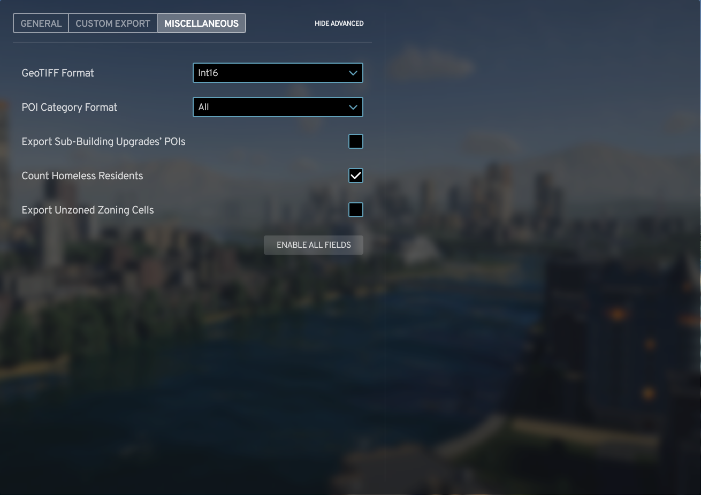
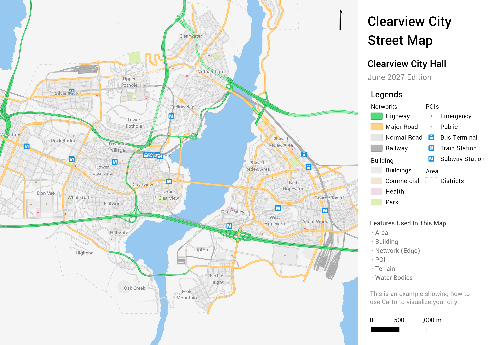

# Carto wiki homepage

Use the Carto mod for Cities: Skylines 2 to export your city data, and visualize it in layers in Geographical Information Systems (GIS) software or online viewers. This can help you analyze your city and plan ahead.

> [!TIP]
> This manual is compatible with version 0.3.

這是 Carto 使用手冊的首頁，[中文版說明|Home-zh](Home-zh.md) 請由此進；**目前手冊適用於版本 0.3**

On this page:

- [Install Carto](#install-carto)
- [Choose file format options](#choose-file-format-options)
- [Set custom export options](#set-custom-export-options)
- [Set miscellaneous options](#set-miscellaneous-options)
- [Export files](#export-files)
- [Post-export: Now what?](#post-export-now-what)
- [Styling examples](#styling-examples)
- [Feedback](#feedback)
- [More info](#more-info)

## Install Carto

Add the mod to Cities:Skylines 2 from [Paradox Mods](https://mods.paradoxplaza.com/mods/87428/Windows), which is the official distribution channel. When you launch the game, the mod should automatically load.

To open Carto, select **Options** (⚙️) &rarr; **Carto** in-game. You can also search for Carto in the navigation bar on the left, then click the text to access settings.

## Choose file format options

On the General tab, you'll select the export format, naming conventions, the coordinates of the map center, and export the files.

> [!IMPORTANT]
> The file format you select affects the variety of the items that can be exported. Use this table to help you choose.

| File Format | Extension                    | Category | Supported Feature Types               | Description                                                                                                                                                                                                                                                                 | Good for displaying                                                                                                |
| ----------- | ---------------------------- | -------- | ------------------------------------- | --------------------------------------------------------------------------------------------------------------------------------------------------------------------------------------------------------------------------------------------------------------------------- | ------------------------------------------------------------------------------------------------------------------ |
| GeoJSON     | `.json`                      | Vector   | Area, Building, Network, POI, Zoning  | The format is simple and lightweight and can be edited using a general text editor. It's suitable for storing and exchanging small amounts of data, but lacks indexing on each feature (metadata is hard to work with), resulting in low search and rendering efficiency.   | Buildings, roads, tracks, pathways, points of interest (POI), district borders, map tile borders, or zoning cells. |
| Shapefile   | `.shp`, `.shx`, `.dbf`, etc. | Vector   | Area, Building, Network, POI,  Zoning | The format is not easy to edit as it's in binary format, and also requires multiple [sidecar files](https://en.wikipedia.org/wiki/Sidecar_file). However, the efficiency of reading and rendering is higher since the features are pre-indexed (more metadata fields used). | Buildings, roads, tracks, pathways, points of interest (POI), district borders, map tile borders, or zoning cells. |
| GeoTIFF     | `.tif`                       | Raster   | Terrain, Water Bodies                 | This image format stores sequential data such as elevation as pixels. You can open the file with major media viewers (such as Microsoft Photos), and use it as a background in GIS tools.                                                                                   | Water bodies or terrain heights.                                                                                   |

### Export file naming formats

The default option is **Feature Type**. You can choose **City Name + Feature Type** or **Map Name + Feature Type**, or create your own. The first two use the map and city name respectively, such as `My City_Area.shp` or `My Map_Building.json`. Select **Custom** to customize the file name.

> [!TIP]
>
> Due to a known issue, the **Custom Name** field doesn't display when you select **Custom Name** from the drop-down. Click **Show Advanced** twice to force the game to reload the user interface.

You can use *tokens* in the **Custom Name** field to include specific information in your filenames:

| Token       | Description                                                                                | Example           |
| ----------- | ------------------------------------------------------------------------------------------ | ----------------- |
| `{Feature}` | The feature type.                                                                          | `Area`            |
| `{City}`    | The name of the city.                                                                      | `My City`         |
| `{Map}`     | The name of the map.                                                                       | `Magnolia County` |
| `{Date}`    | The in-game date that follows [ISO 8601](https://en.wikipedia.org/wiki/ISO_8601) standard. | `2027-04`         |
| `{Time}`    | The in-game time using `HHmm` format.                                                      | `1200`            |

> [!IMPORTANT]
>
> - Tokens are case-sensitive.
> - When you select **Custom**, only one file is created when multiple files are exported under the same name (The file exported previously will be overwritten by the file exported later).

### Latitude and longitude projections

If you provide valid coordinates, Carto can project your city on most places on Earth. You can use online map services like Google Maps to determine the coordinates of your target location. Leave latitude and longitude at `0` for no projection.

To find coordinates, right-click any location on Google Maps, then copy the coordinates that display.

#### Technical details

The Projected Coordinate System (PCS) Carto uses is the [Universal Transverse Mercator](https://en.wikipedia.org/wiki/Universal_Transverse_Mercator_coordinate_system) (UTM), and the datum is [WGS84](https://en.wikipedia.org/wiki/World_Geodetic_System#WGS_84). UTM projection is applicable to any place on Earth as long as they are between 84°N and 80°S. Carto always exports files into UTM / WGS84 zone XXY (EPSG: 326XX / 327XX) projections except for GeoJSONs, since the OGC specification asks the software to treat the value in the spatial fields of GeoJSONs as EPSG: 4326 coordinates.

## Set custom export options

The second tab is the **Custom Export** tab, where you can customize what you export. The options that display depend on the file format you selected on the **General** tab.

These are the features you can customize:

| Feature Name            | Category | Contents                                                       |                Image                 |
| ----------------------- | -------- | -------------------------------------------------------------- | :----------------------------------: |
| Area                    | Vector   | The boundaries of districts and map tiles                      |      |
| Building                | Vector   | The collision area of buildings                                |  |
| Network                 | Vector   | The centerline and the edge of roads, tracks, and pathways     |       |
| POI (Point of Interest) | Vector   | The location of the buildings or transportation stops’ markers |             |
| Terrain                 | Raster   | The terrain elevation                                          |     |
| Water Bodies            | Raster   | The water depths                                               |  |
| Zoning                  | Vector   | The zoning cells (small blocks)                                |       |

In general, you'll only need to select from these six options. If you want to have greater control over the exported fields, select **Advanced Mode**. You can configure each feature type's fields by selecting an option from the **Select Feature** drop-down.

> [!NOTE]
> Due to a known issue, double-click **Show Advanced** button after switching options in the **Select Feature** drop-down to force the game to reload the interface.

Carto provides two types of fields:

- Spatial stores the spatial data (*shapes*) of the currently selected features.
- Non-spatial stores the attribute (*statistical data*) of the currently selected features. You must select at least one spatial field for each feature. There are no restrictions on non-spatial fields because Carto always outputs the Name field of the object.

### Spatial fields

Carto supports these spatial fields.

| Field name      | Version | Feature                                 | Geometry             | Description                                                                                                                                                                                                                                                                                                                                                    |
| --------------- | ------- | --------------------------------------- | -------------------- | -------------------------------------------------------------------------------------------------------------------------------------------------------------------------------------------------------------------------------------------------------------------------------------------------------------------------------------------------------------- |
| Centerline      | 0.1+    | `Network`                               | Vector (Lines)       | The centerline of the network is widely used in network analysis                                                                                                                                                                                                                                                                                               |
| Depth           | 0.1+    | `Water Bodies`                          | Raster (7m × 7m)     | The depth of the water bodies. Depending on the [GeoTIFF Format](#geotiff-format) you choose, the land part (depth = 0) will be replaced by different nodata values.                                                                                                                                                                                           |
| Edge            | 0.1+    | `Area`, `Building`, `Network`, `Zoning` | Vector (Polygons)    | The outline of the features.<ul><li>For `Building` features, this represents *the collision area of the building*.</li> <li>For `Network` features, this represents *the surface area of the networks*.</li></ul>  **Caution**: The exported network edges might have invalid geometries; use the fix geometry function in GIS software to handle the data. |
| Elevation       | 0.1+    | `Terrain`                               | Raster (3.5m × 3.5m) | The elevation of the terrain. This is *not* the distance between terrain and sea level, but the distance between that and the in-game origin.                                                                                                                                                                                                                  |
| Location        | 0.3+    | `POI`                                   | Vector (Points)      | The position of the feature.                                                                                                                                                                                                                                                                                                                                   |
| World Depth     | 0.2.1+  | `Water Bodies`                          | Raster (14m × 14m)   | The depth of the water bodies with the region outside of the playable area (world) included.  Since the depth of the dummy water bodies outside of the playable area is obtained by the difference between the sea level and the terrain, you should only use the value outside of the playable area, in case you want to merge it with the Depth field.    |
| World Elevation | 0.2.1+  | `Terrain`                               | Raster (14m × 14m)   | The elevation of the terrain with the region outside of the playable area (world) included. Since the terrain data from the world heightmap isn't updated by the game, you should only use the value outside of the playable area, in case you want to merge it with the Elevation field.                                                                      |

### Non-spatial fields

Carto supports 23+ 1 non-spatial fields. GeoTIFF *doesn't* have non-spatial fields.

| Field name | Version | Feature                                        | Data type                   | Description                                                                                                                                                                                                                                                                                                                                                                                                                             |
| ---------- | ------- | ---------------------------------------------- | --------------------------- | --------------------------------------------------------------------------------------------------------------------------------------------------------------------------------------------------------------------------------------------------------------------------------------------------------------------------------------------------------------------------------------------------------------------------------------- |
| Address    | 0.2+    | `Building`, `POI`                              | Composite (String, Integer) | The in-game building identifier.This field is a composite field. Three fields will be exported:    <ul><li>GeoJSON: `Address_District`, `Address_Street`, `Address_Number`.<li> Shapefile: `Addr_dist`, `Addr_strt`, `Addr_nmbr`.</li> <li> The buildings will be classified as **(Unincorporated Area)** if they don't belong to any districts.</li><li>Buildings without a house number are assigned the default of 0.</li></li></ul> |
| Area       | 0.1+    | `Area`                                         | Float                       | The extent of the object in **square meters** (m2).                                                                                                                                                                                                                                                                                                                                                                          |
| Asset      | 0.1+    | `Building`, `Network`                          | String                      | The title of the asset.                                                                                                                                                                                                                                                                                                                                                                                                                 |
| Brand      | 0.2+    | `Building`                                     | String                      | The name of the enterprise that rents the property.                                                                                                                                                                                                                                                                                                                                                                                     |
| Category   | 0.1+    | `Building`, `Network`, `POI`                   | String                      | The sub-division of the in-game objects.<ul><li> See the [category list](Category.md) for a detailed list of all possible values.</li><li>A feature can have multiple categories. For example, Incineration Plant has the category of `Public, Power, Waste`, and the Medium road with tram tracks has the category of `Medium, Tram`.                                                                                                  |
| Center     | 0.1+    | `Area`                                         | Composite (Float)           | The center coordinate of the area.<ul><li> This field is a **composite field**. Three fields will be exported:</li>  <li>GeoJSON, Shapefile: `Center_x`, `Center_y`, `Center_z`.<li>The coordinate exported is the in-game coordinates, where the origin is the map center.</li></li></ul>                                                                                                                                              |
| Color      | 0.1.1+  | `Zoning`                                       | String                      | The zoning color in the game.    When the [Use Zone Color Changer’s Color](#UseZoneColorChangersColor) option is enabled, the value will be replaced by the Zone Color Changer mod’s current settings.                                                                                                                                                                                                                           |
| Company    | 0.2.2+  | `Area`                                         | Integer                     | Number of companies in the area.<ul><li> Carto regards a factory or a store as one company. Even if the stores are owned by the same brand, Carto still counts them individually.</li><li>Carto doesn’t export company count of each map tile.                                                                                                                                                                                          |
| Density    | 0.1.1+  | `Zoning`                                       | String                      | The development intensity of the zoning type.<ul><li> The density of zoning:</li>  <li>`Generic`<li> `Low`</li>  <li>`Medium`<li> `High`</li></ul>                                                                                                                                                                                                                                                                                      |
| Direction  | 0.1+    | `Network`                                      | String                      | The direction in which vehicles move:<ul><li>`Both`<li> `Forward`</li>  <li>`Backward`</li></ul>                                                                                                                                                                                                                                                                                                                                        |
| Employee   | 0.2+    | `Area`, `Building`                             | Integer                     | The number of employees in the area.<ul><li> Carto doesn’t export employee count of each map tiles.</li></ul>                                                                                                                                                                                                                                                                                                                           |
| Form       | 0.1+    | `Network`                                      | String                      | The form of the network. <ul><li>`Normal`<li> `Elevated`</li>  <li>`Tunnel`                                                                                                                                                                                                                                                                                                                                                             |
| Height     | 0.1+    | `Network`                                      | Float                       | The average height of the network in meters (m).                                                                                                                                                                                                                                                                                                                                                                                        |
| Household  | 0.2+    | `Area`, `Building`                             | Integer                     | The number of households in the area. <ul><li> When you select [Count Homeless Residents](#CountHomelessResidents), homeless living in parks are counted.</li><li>Carto doesn’t export household count of each map tile.</li></ul>                                                                                                                                                                                                      |
| Length     | 0.1+    | `Network`                                      | Float                       | The length of the network in meters (m).                                                                                                                                                                                                                                                                                                                                                                                                |
| Level      | 0.2+    | `Building`                                     | Integer                     | The upgrade progress of the building.                                                                                                                                                                                                                                                                                                                                                                                                   |
| Name       | 0.1+    | `Area`, `Building`, `Network`, `POI`, `Zoning` | String                      | The name of the object.<ul><li> This is a mandatory field, you *can’t* export without this field.</li></ul>                                                                                                                                                                                                                                                                                                                             |
| Object     | 0.1+    | `Area`, `Building`, `Network`, `POI`, `Zoning` | String                      | Carto's classification of in-game objects:<ul><li>`Building`<li> `District`</li>  <li>`Map Tile`<li> `Pathway`</li>  <li>`Road`<li> `Track`</li>  <li>`Zoning`                                                                                                                                                                                                                                                                          |
| Product    | 0.2+    | `Building`                                     | String                      | The merchandise sold by stores or factories.                                                                                                                                                                                                                                                                                                                                                                                            |
| Resident   | 0.2+    | `Area`, `Building`                             | Integer                     | The number of residents in the area. <ul><li> When [Count Homeless Residents](#CountHomelessResidents) is enabled, the homeless living in the park are counted.</li><li>Carto doesn’t export household count of each map tile.                                                                                                                                                                                                          |
| Theme      | 0.1.1+  | `Building`, `Zoning`                           | String                      | The style of the assets.                                                                                                                                                                                                                                                                                                                                                                                                                |
| Unlocked   | 0.1+    | `Area`                                         | Boolean / Integer           | The purchase status of the map tiles. <ul><li> When exported into GeoJSON: `boolean (true / false)`</li> <li>When exported into Shapefile: integer `(0 / 1)`.</li></ul>                                                                                                                                                                                                                                                                 |
| Width      | 0.1+    | `Network`                                      | Float                       | The width of the network in meters (m).                                                                                                                                                                                                                                                                                                                                                                                                 |
| Zoning     | 0.2+    | `Building`, `Zoning`                           | String                      | The classification of designated development purposes. Features can have multiple zoning; for example, EU Mixed Housing is zoned as `Residential, Commercial`. All zoning types:<ul><li>`None`<li> `Residential`</li>  <li>`Commercial`<li> `Industrial`</li>  <li>`Office`</li></ul>                                                                                                                                                   |

## Set miscellaneous options

The last interface is the **Miscellaneous** tab. The first option is the **GeoTIFF Format**. You can choose from Int16, Norm16, and Float32 formats.

| Abbreviation | Full Name                | Description                                                                                     |
| ------------ | ------------------------ | ----------------------------------------------------------------------------------------------- |
| Int16        | 16-bit Integer           | The default option that provides a reasonable ratio between the details and the file size.      |
| Norm16       | 16-bit Normalized Number | The option that normalizes Int16’s data. *This can be used as the heightmap in the map editor*. |
| Float32      | 32-bit Float Number      | The option includes extra information in decimals, but *the file size is twice as big*.         |

For the **POI Category Format**, you can select:

- **All** to export all applicable POI categories. All is the default.
- **Single** to export the most applicable one.

Select **Export Sub-Building Upgrades’ POIs** to export sub-building upgrades as points of interest.

Select  **Count Homeless Residents** to count the homeless that *live in parks*. This table explains how Carto performs the census when **Count Homeless Residents** is enabled:

| Field                | Normal Citizens | Homeless                     | Foreigners (Tourist / Transit / Migrant Workers) | Description                                                                |
| -------------------- | --------------- | ---------------------------- | ------------------------------------------------ | -------------------------------------------------------------------------- |
| Household / Resident | ✅               | ⚠️Only those live in parks | ❌                                                | The homeless without any temporary shelters can be regarded as foreigners. |
| Employee             | ✅               | ✅                            | ✅                                                | The homeless and migrant workers are valid workers.                        |

Select  **Export Unzoned Zoning Cells** to export every zoning cell, even if they're not zoned (empty). Disable this option to reduce the file size.

If you have the [Zone Color Changer](https://mods.paradoxplaza.com/mods/81568/Windows) mod installed, select **Use Zone Color Changer’s Color** to replace the default colors with Zone Color Changer’s settings.

## Export files

Click **Export Files**  on the **General** tab to export in-game objects and data. Once the export finishes, click **Open Export Directory** to access the output folder (`C:\Users\<UserName>\AppData\LocalLow\Colossal Order\Cities Skylines II\ModsData\Carto`). Since Carto can only collect the relevant data after a save is loaded or an editor is launched, **Export Files** remains disabled until the condition is met.

You can reset all settings by clicking **Reset Mod Settings**. To prevent accidental clicks, a confirmation dialog displays.

## Post-export: Now what?

After you export the files, how do you view and use the data?

### Use Carto data with GIS software

We recommend GIS software because it provides not only a powerful platform to view and edit the data, but also a set of tools to perform in-depth geographical analysis:

- [QGIS](https://www.qgis.org/) is free, open-source software with numerous plug-ins developed and maintained by volunteers, which is why it's recommended. Here's a [step-by-step tutorial](Tutorial.md) to export maps with Carto and QGIS.
- [ArcGIS Pro](https://pro.arcgis.com/en/pro-app/latest/get-started/get-started.htm) is paid software developed by Esri. Compared to its online version (ArcGIS Online), the desktop version has many more analysis tools you can choose from (recommended if you have a license).

### Use Carto data with online viewers

If you want to visualize the exported files but don’t have access to GIS software, you can use these sites to upload and view your geospatial data:

- [mapshaper](https://mapshaper.org/) supports GeoJSON and Shapefile. You can import multiple layers and the file-loading process is efficient. (Recommended)
- [geojson.io](https://geojson.io/) supports GeoJSON. You can edit the shape and change the color at the same time. (Recommended)
- [Survey Transfer](https://app.surveytransfer.net/) supports GeoJSON, Shapefile, and GeoTIFF. The website requires you to register your account only with a 14-day free trial. (Not recommended)
- [ArcGIS Online](https://maps.arcgis.com/apps/mapviewer/index.html) supports GeoJSON, Shapefile, and GeoTIFF. However, you have to purchase the license to access the features. (Not recommended if you don’t have a license.)

### Use Carto data with geospatial libraries

If you want to develop an application that works with the data, consider these libraries:

- [GDAL](https://github.com/OSGeo/gdal) is a library that serves as a convertor between multiple geospatial data formats.
- [GeoPandas](https://github.com/geopandas/geopandas) is a Python library where you can access data by the class `GeoDataFrame`.
- [sf](https://github.com/r-spatial/sf) is an R library where you can access data by the class `sf` (simple feature).

You can find more information on this topic at [Awesome GIS](https://github.com/sshuair/awesome-gis).

## Styling examples

You can change the display of data like points of interest using Carto styles in tools like QGIS.

- A classic street map using Area, Building, Network (Edge), POI, Terrain, and Water Bodies features:

    

- A map showing the fierce competition of the beverage industry in the city, using Area, Building, and Water Bodies features:

    

    <!-- a tutorial on how to do this would be fantastic! -->

This is an example showing that you can use Building, Network, and Zoning features to assist your georeferencing process:

## Feedback

You can reach me at:

- 🌐 [Paradox Forum](https://forum.paradoxplaza.com/forum/threads/carto.1699089/)
- 🛜 [Cities: Skylines Modding](https://discord.gg/HTav7ARPs2) - *English ONLY*
- 🛜 [Cities: Skylines Taiwan Assets](https://discord.gg/Gz4K66jT64) - *Chinese preferred*
- 📧 [4alpelna4lve@gmail.com](mailto:4alpelna4lve@gmail.com)

 Use GitHub’s issues or discussions to start a more in-depth discussion or report complicated bugs, as it isn’t easy to track them between threads.

## More info

- [Carto/GIS tutorial](Tutorial.md)
- [Changelog](carto-changelog.md)
