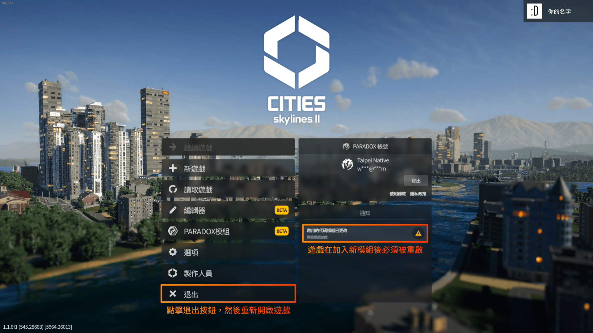
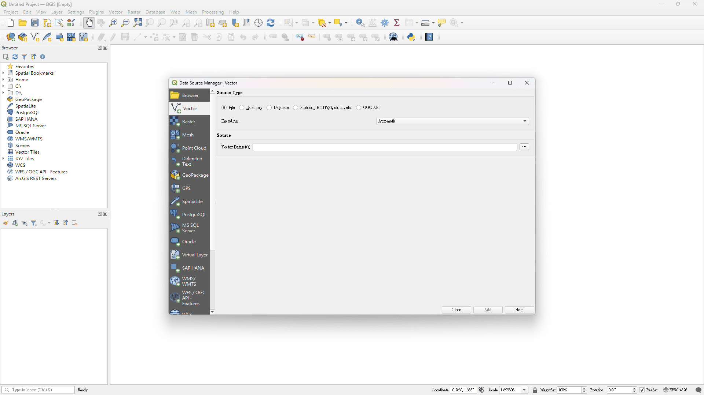
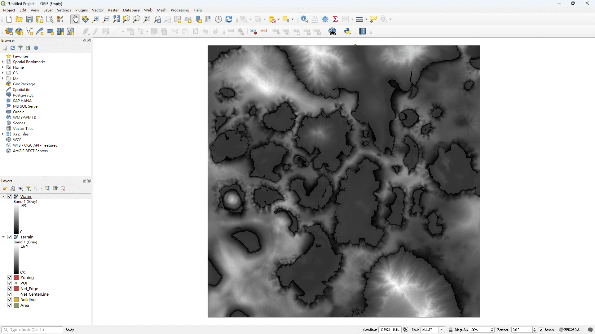
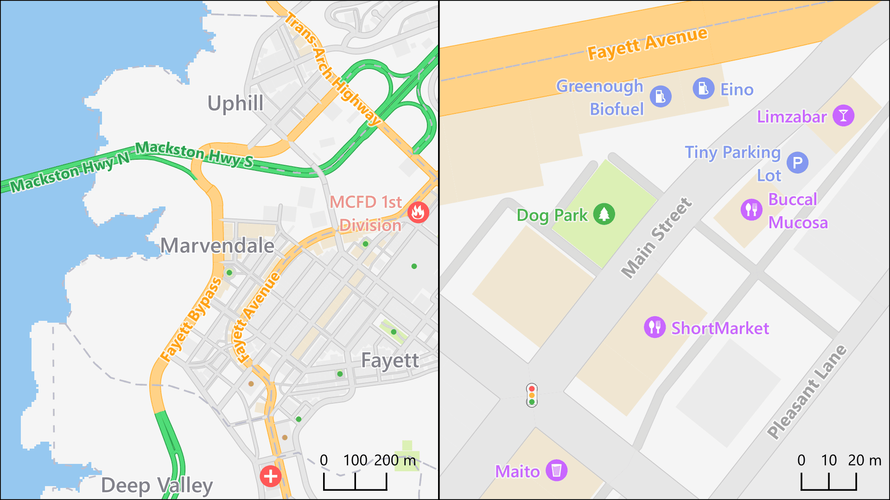
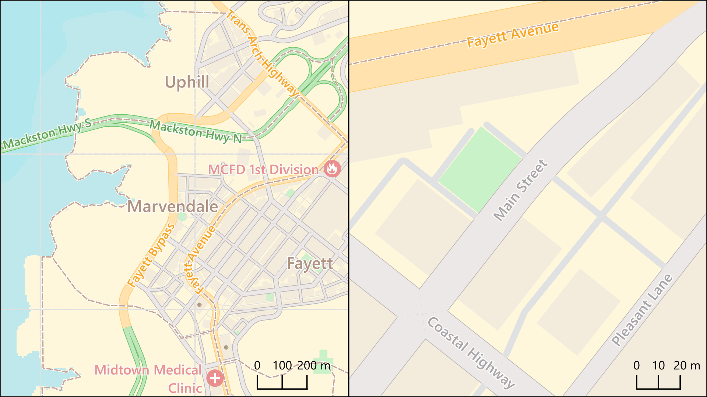
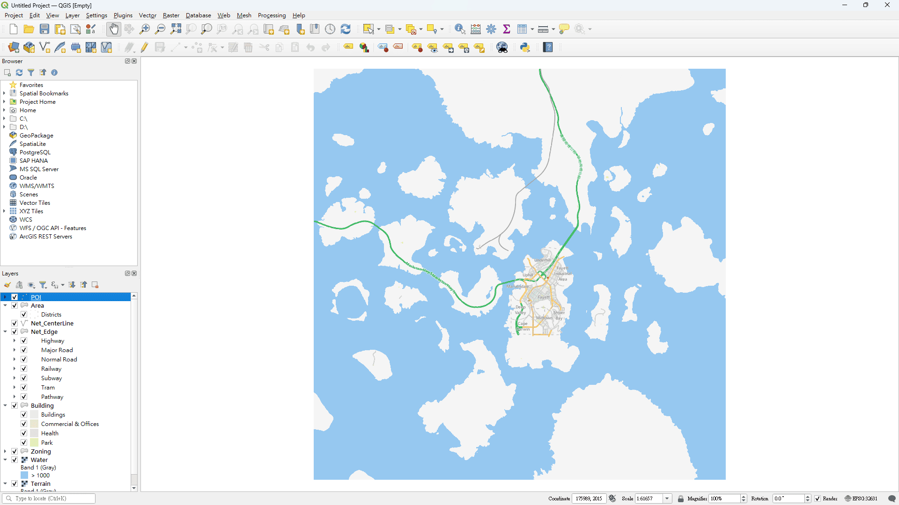
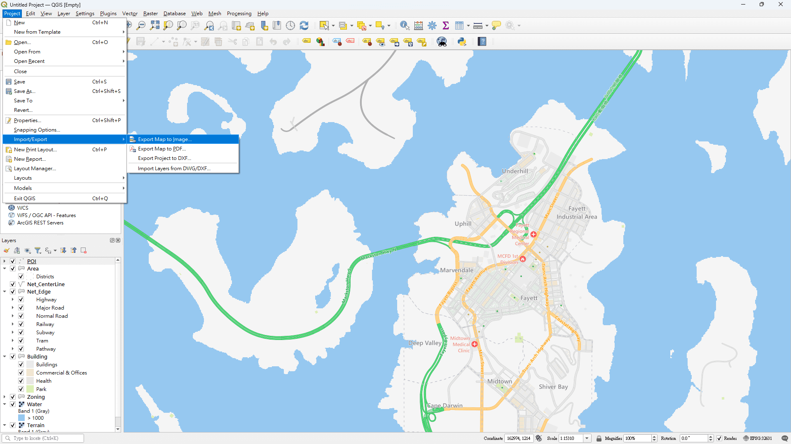

這是一份循序漸進地教導你使用 Carto 和 QGIS 製作你的城市地圖的教學。若需要了解所有技術細節，請參閱[[使用手冊|Home-zh]]。

This is the step-by-step tutorial of using Carto & QGIS to make a beautiful map of your city; please visit [[English version|Tutorial]] here.

## 第一部分：Carto

### 安裝

你可以透過在遊戲內或線上的 [Paradox Mods](https://mods.paradoxplaza.com/mods/87428/Windows) 搜尋「Carto」來將模組加入現有的遊玩集（需先登入 Paradox 帳號），Carto 的縮略圖包含了卡其色的地圖與白色的背景。待模組加入遊戲後，請應遊戲要求重新啟動遊戲，以確保模組正常載入。

> **圖 1**  
> 點擊「添加到激活中的 PLAYSET」按鈕以安裝模組。
> 

> **圖 2**  
> 待 Carto 加入後，請重新啟動遊戲。
> 

### 輸出

遊戲重新啟動後，開啟你想要輸出城市的存檔。等你的城市載入後，點擊畫面右上角、帶有齒輪圖案（⚙️）的按鈕，接著是「選項」按鈕。請點擊左邊側欄中的「Carto」選項。

> **圖 3**  
> 前往 Carto 的選項頁面。
> 

在選項頁面中有許多可以調整的選項，但我們目前不需要理會大部分的選項（**註**：如果你在版本 0.3 以前添加了 Carto，你應該點擊「重置設定」按鈕，因為部分預設輸出欄位已經變更）。在這裡我們只關心兩個選項：「檔案格式」下拉式選單和「輸出檔案」按鈕。請從下拉式選單中選擇「Shapefile」選項，接著按下「輸出檔案」按鈕。輸出的時長根據城市大小而定，可能長至一分鐘左右；輸出完成時，一個對話框將會彈出，提醒你已經輸出成功了。接著請在下拉式選單選擇「GeoTIFF」選項、點擊「輸出檔案」按鈕，並等候輸出完成。

> **圖 4**  
> 輸出檔案的步驟。
> 

最後，點擊「檢視輸出位置」按鈕，前往輸出位置的資料夾（預設位置在 `C:\Users\<使用者名稱>\AppData\LocalLow\Colossal Order\Cities Skylines II\ModsData\Carto`）；這個路徑稍後會在 QGIS 中使用到。

> **圖 5**  
> 在檔案總管中開啟的輸出位置資料夾。
> 

## 第二部分：QGIS

### 下載與安裝

請前往 [QGIS 的官方網站](https://www.qgis.org/)取得安裝檔案——請安裝不晚於 3.28 'Firenze' 版本的長期維護版本（Long Term Release，LTR），因為這些版本較為穩定。以撰寫教學的時間點（2024 年 9 月）而言，最新的 LTR 版本是 3.34 'Prizren'。**\*** 下載完成後，請依循安裝精靈的指示完成安裝；如果你在下載與安裝 QGIS 時遇到了問題，請參閱 QGIS 的 [FAQ](https://www.qgis.org/resources/support/faq/) 與 [安裝指南](https://www.qgis.org/resources/installation-guide/)。

**\***：理論上任何 3.x 版本「應該」不會有太大的問題，但我沒有測試過 3.28 以前的版本是否可以完成教學。

> **圖 6**  
> 下載 QGIS 的步驟。
> 

### 新增圖層

安裝完成後就能開啟你的 QGIS 了；QGIS 的執行檔案預設位於 `C:\Program Files\QGIS <版本號碼>\bin\qgis-ltr-bin.exe`。由於 QGIS 包含的繁體中文翻譯並不完整（除了因缺少部分翻譯而顯示英文外，還有繁簡混雜的問題），以下教學將以英文介面為主，附上其中文名稱以供參考。待 QGIS 開啟後，首先要開啟一個新專案：請點擊左上角的「Project 專案」，然後選擇「New 新增」選項。如此一來，一個新的專案便建置完成了。緊接著點擊上方工具列中的「Layer 圖層」，並接著選取「Add Layer 加入圖層」、「Add Vector Layer... 加入向量圖層…」選項以呼叫出 Data Source Manager 数据源管理器 視窗。請點擊帶有三個點（刪節號）的按鈕，並前往 [Carto 在 ModsData 的資料夾](#圖5)。選取 Shapefile 資料夾中所有副檔名為 `.shp` 的檔案（包括：`Area.shp`、`Building.shp`、`Net_CenterLine.shp`、`Net_Edge.shp`、`POI.shp` 及 `Zoning.shp`），然後依序點擊「Open 開啟」、「Add 加入」與「Close」按鈕。如果你順利地進行到這邊，目前你的專案內應該有六個圖層了。假如你的圖層和下方範例中顯示的顏色不同也不需緊張，因為新加入的圖層顏色是由 QGIS 隨機產生的。

> **圖 7**  
> QGIS 啟動後的預設介面。
> 

> **圖 8**  
> 新增一個 QGIS 專案。
> 

> **圖 9**  
> 添加向量圖層（1／2）
> 

> **圖 10**  
> 添加向量圖層（2／2）
> 

> **圖 11**  
> 成功添加向量圖層後的專案樣貌。圖層顏色若與圖中不同是正常的。
> 

現在來添加網格圖層：一樣點擊上方工具列中的「Layer 圖層」，並接著選取「Add Layer 加入圖層」、「Add Raster Layer... 加入柵格圖層…」選項以呼叫出 Data Source Manager 数据源管理器 視窗；這次請選擇 GeoTIFF 資料夾中所有副檔名為 `.tif` 的檔案（包括：`Terrain.tif` 和 `Water.tif`）。將這些圖層加入後，現在工作區內應該會有八個圖層。別忘了前往「Project 專案」＞「Save 儲存」（或點擊磁碟圖示（💾）按鈕）以儲存專案。

> **圖 12**  
> 成功添加網格圖層後的專案樣貌。
> 

### 設定圖層樣式

在正式開始設定圖層樣式前，請先調整圖層之間的顯示順序——在畫面左下角的 Layers 圖層 面板中，透過按住圖層名稱並拖曳便可改變其顯示順序。在這份教學中，我建議由上至下的順序是：*POI*、*Area*、*Net_CenterLine*、*Net_Edge*、*Building*、*Zoning*、*Water* 及 *Terrain*。

> **圖 13**  
> 調整顯示順序後的專案樣貌。
> 

Carto 目前共提供三種預製地圖樣式：Plan、Street 和 Topo。你可以在下方照片中看見每種樣式的樣貌：

> **圖 14**  
> Plan：以白色背景搭配灰階主色系的風格，適合用來規劃城市發展。
> 

> **圖 15**  
> Street：擁有繽紛色彩的風格，顯示出生動的細節。
> 

> **圖 16**  
> Topo：擁有低飽和度色彩及較少興趣點資訊，適合作為底圖使用。
> 

接著說明如何套用圖層樣式。右鍵點擊 Layers 圖層 面板中的圖層名稱，然後選擇選單中的「Properties... 屬性…」以呼叫 Layer Properties 視窗。請點擊視窗底部的「Style 樣式」按鈕，並選擇「Load Style... 加载样式…」選項；此時 Database Styles Manager 数据库样式管理器 視窗將會出現。在你載入樣式前，請確定已勾選 Categories 类别 部分的（1）Symbology 符號學 和（2）Labels 標記設計 選項（值得注意的是，網格圖層只有 Symbology 符號學 選項）。

> **圖 17**  
> 開啟 Database Styles Manager 数据库样式管理器 視窗的步驟。
> 

在這個教學中，我會示範如何套用 Street 地圖樣式，對於其他的樣式而言，步驟其實大同小異。請點擊帶有三個點（刪節號）的按鈕，並前往 Carto 資料夾中的 Styles 資料夾。由於我選取的圖層是 POI（興趣點），因此我會選擇 `Street` 資料夾中的 `Street-POI-Location (Chinese).qml` 檔案。這些地圖樣式檔案的命名大致遵循 `<樣式名稱>-<圖徵類型>-<空間欄位名稱>.qml` 的規則，並且被放置在與其樣式相同名稱的資料夾中。你可以參照下方**表 1** 來了解有哪些可以使用的樣式檔案。最後，依序點擊「Open 開啟」、「Load Style 載入樣式」與「OK」按鈕，即成功添加該圖層的樣式。

> **表 1**  
> 各種圖徵的對應地圖樣式檔案。
> | 圖徵類型      | 對應檔案名稱                          | 附有書寫系統後綴（如 Chinese）的樣式 | 註記 |
> | :----------: | ------------------------------------ | :--------------------------------: | --- |
> | 區域         | \<樣式名稱\>-Area-Edge.qml            |                            所有樣式 |     |
> | 建築         | \<樣式名稱\>-Building-Edge.qml        |                               Plan |     |
> | 網路         | \<樣式名稱\>-Network-Centerline-Labels.qml |                       所有樣式 | (1) |
> | -            | \<樣式名稱\>-Network-Centerline-Arrows.qml |                               | (2) |
> | -            | \<樣式名稱\>-Network-Edge.qml         |                                    |     |
> | 興趣點       | \<樣式名稱\>-POI-Location.qml         |                      Street 和 Topo |     |
> | 地形         | \<樣式名稱\>-Terrain-Elevation.qml    |                                    |     |
> | 水體         | \<樣式名稱\>-Water-Depth.qml          |                                    | (3) |
> | 分區         | \<樣式名稱\>-Zoning-Edge.qml          |                                    | (4) |
>
> 註記： 
> （1） 道路的標籤（路名）。 
> （2） 道路的行駛方向箭頭。 
> （3） Topo 獨有：後綴 `-Background` 表示背景色、`-Contours` 表示等高線、`-Hillshade` 表示地形陰影。 
> （4） 後綴 `(By Color)` 表示使用顏色欄位的值、`(By Zoning)` 表示使用分區欄位的值。

對剩下的每一個圖層重複上述的操作，你便可以獲得與下圖類似的地圖；當你完成後，別忘了儲存專案！

> **圖 18**  
> 對每個圖層套用地圖樣式後的樣貌。
> 

### 常用的 QGIS 操作

#### 平移與縮放地圖

首先請確定目前處在「平移」模式之中——啟動的按鈕位於上方工作列中，是一個帶有手套或舉起的手圖示（🤚）的按鈕（你也可以在上方選單中的 View 檢視＞Pan Map 平移地圖 中找到它）。將滑鼠游標移至畫布處，按住左鍵不放並向任一方向移動即可平移地圖；向前、後滾動滑鼠滾輪以放大、縮小地圖。

相關 QGIS 說明文件：*[Navigating the Map Canvas](https://docs.qgis.org/3.34/en/docs/training_manual/basic_map/mapviewnavigation.html)*

#### 縮放回全圖範圍

點擊上方工具列中帶有一個放大鏡與三個向外箭頭圖示（🔎＋↖＋↗＋↘）的「Zoom Full 全圖顯示」按鈕，即可回復至所有圖層的範圍。

相關 QGIS 說明文件：*[Exploring the map view](https://docs.qgis.org/3.34/en/docs/user_manual/map_views/map_view.html#exploring-the-map-view)*

#### 顯示與隱藏圖層

透過點擊 Layers 圖層 面板中圖層名稱旁的方框來切換顯示／隱藏該圖層，或是使用同面板工具列中帶有一顆眼球圖示（👁️）的「Manage Map Themes 管理地图主题」按鈕。該按鈕選單提供以下選項：「Show All Layers 顯示所有圖層」、「Hide All Layers 隱藏所有圖層」、「Show Selected Layers 顯示已選擇的圖層」、「Hide Selected Layers 隱藏已選擇的圖層」及「Toggle Selected Layers 切换选中圖層」。

相關 QGIS 說明文件：*[Configuring map themes](https://docs.qgis.org/3.34/en/docs/user_manual/introduction/general_tools.html#configuring-map-themes)*

#### 顯示與隱藏標籤

有時我們需要切換標籤的顯示狀態以看清文字底下的細節。透過對 Layers 圖層 面板中的圖層名稱點擊右鍵，你可以使用選單中的「Show Labels 显示标注」選項來切換其顯示狀態。

相關 QGIS 說明文件：*[Overview of the context menu of the Layers panel](https://docs.qgis.org/3.34/en/docs/user_manual/introduction/general_tools.html#overview-of-the-context-menu-of-the-layers-panel)*

#### 添加外部地圖

如果要添加諸如 Google Maps 或 OpenStreetMap 等外部地圖作為畫布的背景，請前往畫面左側的 Browser 瀏覽器 面板的「XYZ Tiles」選項，並點擊名稱旁的三角形（▸）來查看其內容。如果想要添加 OpenStreetMap 到畫布中，只需要雙擊同名選項便可將其加入至畫布區域。加入 Google Maps 的步驟比較麻煩一些，請對「XYZ Tiles」點擊右鍵並選擇「New Connection... 新建连接…」選項，即可呼叫出 XYZ Connection XYZ连接 視窗。你可以在此輸入想要的連線名稱（例如 Google Maps）與指向 Google XYZ 圖磚伺服器的路徑（`http://mt0.google.com/vt/lyrs=m&x={x}&y={y}&z={z}`）；輸入完成後，點擊「OK」按鈕儲存連線。接著便可以在列表中雙擊剛輸入的連線名稱，將地圖添加至畫布內。

相關 QGIS 說明文件：*[Using XYZ Tile services](https://docs.qgis.org/3.34/en/docs/user_manual/managing_data_source/opening_data.html#using-xyz-tile-services)*

> **圖 19**  
> 添加新的 XYZ 圖磚連線。
> 

#### 顯示隱藏的面板

如果意外地關閉了需要的面板，透過在上方工具列空白處點擊右鍵（或前往上方選單中的 View 檢視＞Panels 版面配置 ），你可以在選單中勾選所有需要顯示或隱藏的面板。

相關 QGIS 說明文件：*[Panels](https://docs.qgis.org/3.34/en/docs/user_manual/introduction/general_tools.html#panels)*

#### 自訂圖層的符號與標籤

不滿意 Carto 的顏色或標籤設定？你可以自己更改成喜歡的樣子！對 Layers 圖層 面板中的圖層名稱點擊右鍵，接著點擊選單中的「Properties... 屬性…」以呼叫 Layer Properties 視窗（或按下 F7 顯示 Layer Styling 圖層样式 面板）。在 Symbology 符號學 和 Labels 標記設計 頁籤中，你可以進一步自訂這些顏色與標籤的屬性。請參閱 QGIS 的說明文件以學習如何自訂樣式。

相關 QGIS 說明文件： 
&emsp;訓練手冊（簡單－中等）：*[Lesson: Symbology](https://docs.qgis.org/3.34/en/docs/training_manual/basic_map/symbology.html)* 及 *[Lesson: Labels](https://docs.qgis.org/3.34/en/docs/training_manual/vector_classification/label_tool.html)* 
&emsp;使用手冊（中等－進階）：*[Vector Symbology Properties](https://docs.qgis.org/3.34/en/docs/user_manual/working_with_vector/vector_properties.html#symbology-properties)*、*[Vector Labels Properties](https://docs.qgis.org/3.34/en/docs/user_manual/working_with_vector/vector_properties.html#labels-properties)* 及 *[Raster Symbology Properties](https://docs.qgis.org/3.34/en/docs/user_manual/working_with_raster/raster_properties.html#symbology-properties)*

#### 其他操作

請參考 [QGIS 官方說明文件網站](https://docs.qgis.org/3.34/en/docs/index.html)以了解如何達成該操作。

### 輸出地圖

在將地圖樣式設定為喜歡的樣子後，你或許會想要將地圖輸出為圖片或 PDF。最簡單的方法是從上方選單中依序選擇「Project 專案」、「Import/Export 匯入/匯出」和「Export Map to Image... 匯出地图为图像…」（或「Export Map to PDF... 匯出地图为PDF文件…」）選項。你只需要在 Save Map as Image 地图另存为图像 視窗中點擊「Save」按鈕，並且為你的檔案取名就行了。然而這種方式產生的檔案只會輸出目前畫面範圍內的地圖**\***，而且你不能便捷地重複使用該設定。

**\***：事實上你「可以」在該視窗中變更輸出的範圍，但我認為在排版編輯器內此操作會更直覺。

> **圖 20**  
> 快速輸出地圖。
> 

正式的方法則是使用擁有高度客製化與可重複使用特性的列印排版功能。請從上方選單中依序選擇「Project 專案」及「New Print Layout 新建列印圖面配置」選項（或是點擊在上方工具列中，儲存圖示右邊、由一把尺、黃色星型與一張紙構成的圖示（📄＋📏＋\*）的「New Print Layout 新建列印圖面配置」按鈕）。待輸入完新列印排版的名稱後，點擊「OK」按鈕，一個排版編輯器視窗便會出現。

> **圖 21**  
> 新增列印排版。
> 

首先請按下 V 鍵，點擊白色的畫布，接著在右邊面板中選擇「Item Properties 项属性」分頁；你可以在這裡設定畫布（輸出範圍）的大小等屬性。接著點擊左邊工具列中的「Add Map 加入地圖」按鈕，並在畫布上拖曳出適當大小的矩形（即地圖的位置），地圖將很快地渲染完成。如果需要平移、縮放地圖的內容，點擊左邊工具列內的「Move item content 移動項目內容」按鈕（或按下 C 鍵）後，你便能像在 QGIS 的主視窗那樣用滑鼠左鍵與滾輪平移、縮放地圖了。最後，請使用上方工具列的「Export as Image 匯出成影像」或「Export as PDF 匯出为PDF文件」按鈕，將你的城市匯出。更多關於排版的資訊，請參閱 QGIS 的說明文件。

相關 QGIS 說明文件：*[Using Print Layout](https://docs.qgis.org/3.34/en/docs/training_manual/map_composer/map_composer.html)* 及 *[Laying out the maps](https://docs.qgis.org/3.34/en/docs/user_manual/print_composer/index.html)*

> **圖 22**  
> 排版編輯器的預設樣貌與常用的工具。
> 

噠啦，這就是這份教學的終點了。如果對於教學有任何疑問的話，你可以透過 GitHub 的 [Discussions](https://github.com/taipei-native/Carto/discussions)、[Paradox 論壇](https://forum.paradoxplaza.com/forum/threads/carto.1699089/)、[Cities: Skylines Modding](https://discord.gg/HTav7ARPs2) Discord 伺服器（**只能使用英文**）、[Cities: Skylines Taiwan Assets](https://discord.gg/Gz4K66jT64) Discord 伺服器（偏好中文）及[電子郵件](mailto:4alpelna4lve@gmail.com)聯繫我。感謝你下載 Carto，並閱讀完這篇教學 ヾ(*´∀ ˋ*)ﾉ
