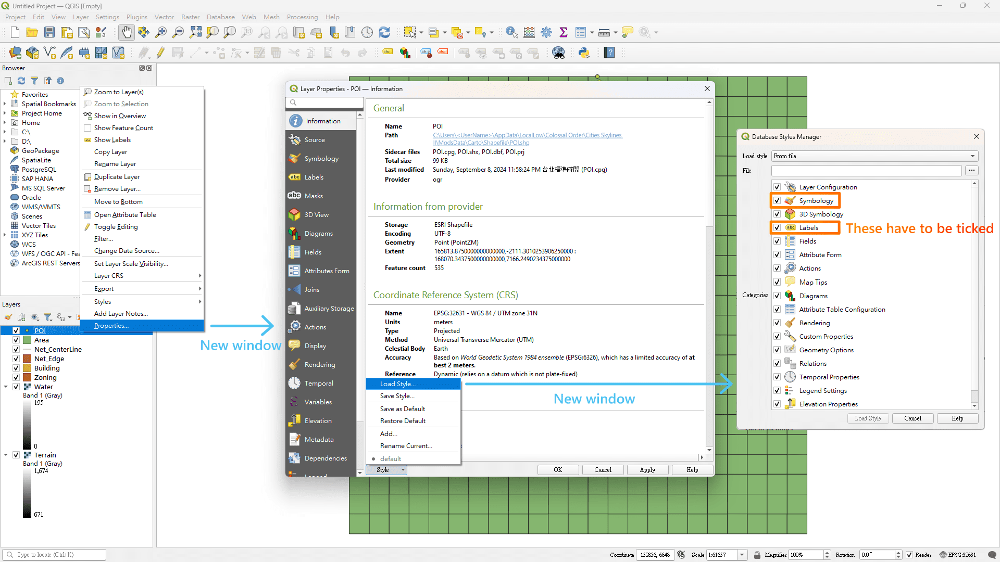
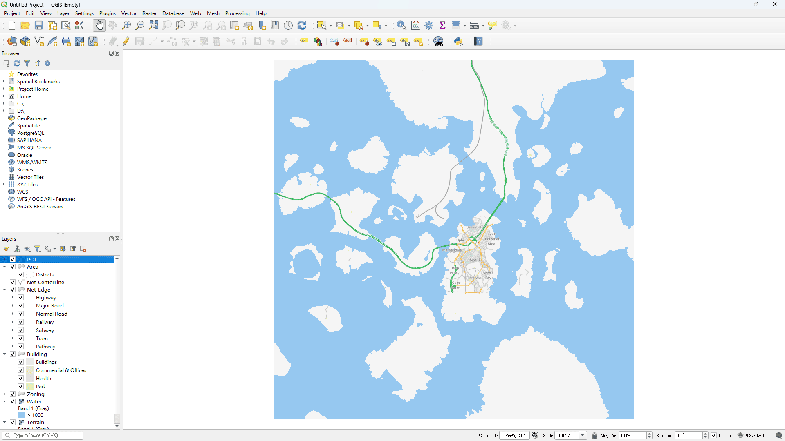
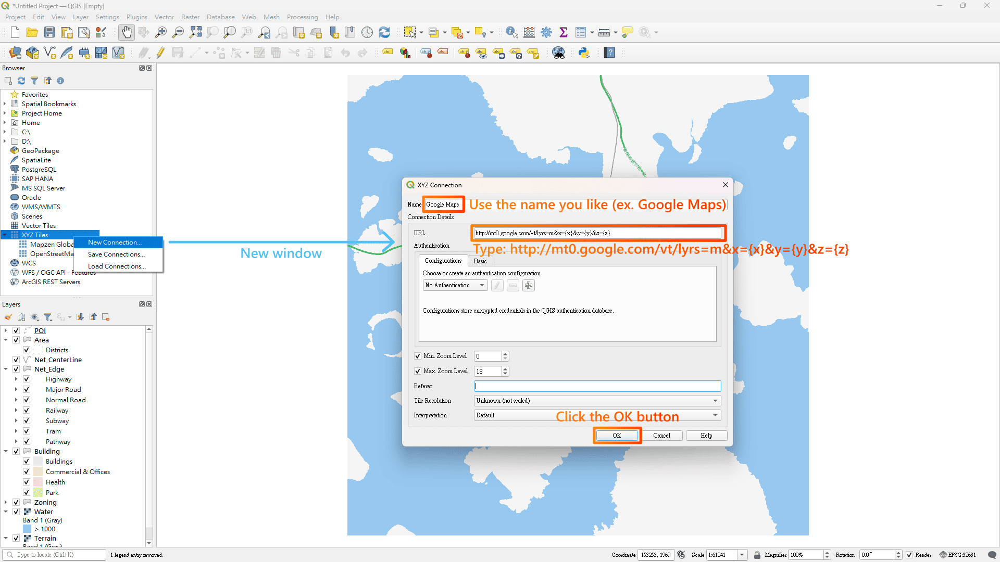
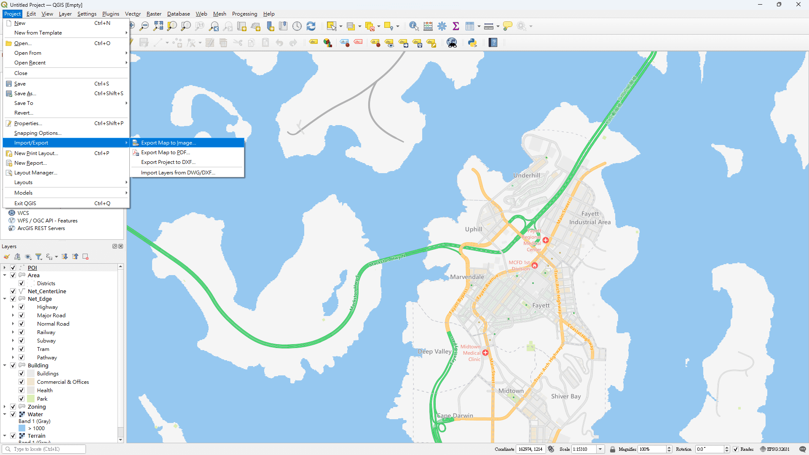

This is the step-by-step tutorial of using Carto & QGIS to make a beautiful map of your city. Please refer to the [[main manual|Home]] for all technical details.

這是一份使用 Carto 和 QGIS 製作你的城市地圖的教學，**[[中文版教學由此進|Tutorial-zh]]**。

## Part I: Carto

### Installation

You can add the mod to your current playlist by searching “Carto” on the [Paradox Mods](https://mods.paradoxplaza.com/mods/87428/Windows) in-game or online (you have to log-in your Paradox account first); there’s a khaki-ish map image with the white background on the icon. After the mod is added, it is required to restart the game.

> **Figure 1**  
> *Click the “Add to Active Playset” button to add Carto to your game.*
> 

> **Figure 2**  
> *Restart the game after adding Carto.*
> 

### Exporting

Next, open the save you want to export when the game is ready. After the game finishes loading your save, click on the button with a gear icon (⚙️) on the top-right corner of the screen and then the button labeled as “Options”. Navigate to the option called “Carto” in the left sidebar.

> **Figure 3**  
> *Navigate to Carto’s options.*
> 

There are many options you can configurate, but for now we will leave them as they are (If you added the mod before the version 0.3, you shall reset your settings as there are some modifications on the default exporting fields, which will be used later in this tutorial). We only care about two options in this tutorial: the “Exported File Format” dropdown and the “Export” button. Please select the option “Shapefile” in the dropdown, and then hit the “Export” button. The export may take up to a minute, depending on your city size. After the export finishes, a dialog would inform you the export was successful. With the dropdown value set to “GeoTIFF”, please click the “Export” button again and wait until the export ended.

> **Figure 4**  
> *Steps to export the files.*
> 

Lastly, you can click the “Open Export Directory” button to reveal the location of the exported files (default to be `C:\Users\<UserName>\AppData\LocalLow\Colossal Order\Cities Skylines II\ModsData\Carto`), which will be used in QGIS soon.

> **Figure 5**  
> *The export directory revealed in the File Explorer.*
> 

## Part II: QGIS

### Download & Installation

You can visit [QGIS’s official website](https://www.qgis.org/) to obtain the binary installer. In order to complete the tutorial, you shall install the version no prior than 3.28 'Firenze', and I recommend you to download the latest long term release (LTR) version, which is more stable (As of September 2024, the LTR version is 3.34 'Prizren'; theoretically any 3.x version *may* be fine, but I haven’t check the versions prior than 3.28). After you download the installer, you can install the program by following the install wizard’s instruction. If you encounter any problem when downloading / installing QGIS, please refer to the article provided by QGIS: [FAQ](https://www.qgis.org/resources/support/faq/) & [Installation Guide](https://www.qgis.org/resources/installation-guide/).

> **Figure 6**  
> *Downloading QGIS.*
> 

### Adding Layers

You can launch your QGIS after the installation; the executable is located in `C:\Program Files\QGIS <Version Number>\bin\qgis-ltr-bin.exe` by default. When the QGIS is ready, click on the “Project” button on the top-left corner, and then select the “New” option. In this way, we have created the workspace (‘project’) where we can work on later. Next, navigate to and click on the “Layer” button in the top most menu, and then select “Add Layer” and “Add Vector Layer...” options. The Data Source Manager window will show up and ask you to provide the link to the vector source. Click on the button with three dots (ellipsis), and then navigate to [Carto’s ModsData folder](#Figure5). Please select all files with the extension `.shp` in the Shapefile folder (`Area.shp`, `Building.shp`, `Net_CenterLine.shp`, `Net_Edge.shp`, `POI.shp` & `Zoning.shp`), and then click “Open”, “Add” & “Close” buttons in order. There should be six layers in your workspace now; don’t worry about the color differences, as they are randomly generated by QGIS.

> **Figure 7**  
> *The default interface of QGIS after startup.*
> 

> **Figure 8**  
> *Creating a new QGIS project.*
> 

> **Figure 9**  
> *Adding vector layers. (1/2)*
> 

> **Figure 10**  
> *Adding vector layers. (2/2)*
> 

> **Figure 11**  
> *The workspace after adding vector layers. It is normal that your colors are different from mine.*
> 

Now we want to add raster layers. Navigate to and click on the “Layer” button in the top most menu, and then select “Add Layer” and “Add Raster Layer...” options. Again, the Data Source Manager window will pop up and ask for the link to the dataset, and please select all files with the extension `.tif` in the GeoTIFF folder (`Terrain.tif` & `Water.tif`) this time. There are eight layers in the workspace in total after you added the files; remember to save the project by navigating to the “Project” > “Save” option or clicking on the floppy disk / save icon.

> **Figure 12**  
> *The workspace after adding raster layers.*
> 

### Styling Layers

Before stying the map, you have to re-arrange the layer order first. You can achieve this by clicking and dragging the layer titles that appear in the bottom-left Layers panel. In this tutorial, the recommended layer order from the top to the bottom is: *POI*, *Area*, *Net_CenterLine*, *Net_Edge*, *Building*, *Zoning*, *Water*, and *Terrain*.

> **Figure 13**  
> *The workspace after layer re-arrangements.*
> 

Carto currently provides three style presets (Plan, Street & Topo). You can check their appearances in the images below:

> **Figure 14**  
> *Plan - A style featuring white background and greyscale palette, making it easy to plan your city ahead.*
> 

> **Figure 15**  
> *Street - A style featuring colorful roads and POIs, showing lively details.*
> 

> **Figure 16**  
> *Topo - A style featuring background with lower saturation and less POI information, making it a good background map.*
> 

To apply style presets on the layers, please right click on the layer name in the layer panel, and then select “Properties...” option at the bottom of the menu. The Layer Properties window will appear after you select the option. Next, left click on the “Style” button at the bottom edge of the window, and then select the “Load Style...” option. In this way, the second window called Database Styles Manager will show up. Before you load the style, please make sure the (1) Symbology and (2) Labels checkboxes in the Categories section are ticked (note that raster layers only have the Symbology checkbox).

> **Figure 17**  
> *Steps to open Database Styles Manager window.*
> 

I’m using the Street style in this tutorial, but the steps are similar for other style presets. Click on the button with three dots (ellipsis), and then navigate to the Styles folder in Carto’s ModsData folder. Since the layer I clicked was POI, I will go to the folder with the name of my desirable style, which is `Street` in this case, and then choose the file `Street-POI-Location (Latin).qml`. Finally, you can click the “Open”, “Load Style” & “OK” buttons in order. The naming of style preset files generally follow the rule of `<StyleName>-<Feature>-<SpatialFieldName>.qml`; the table below shows the corresponding style preset files of each layer:

> **Table 1**  
> *The style presets for each feature type.*
> | Feature Type | Corresponding File Name              | Style with Script Suffixes | Notes |
> | :----------: | ------------------------------------ | :------------------------: | ----- |
> | Area         | \<StyleName\>-Area-Edge.qml          |                      *All* |       |
> | Building     | \<StyleName\>-Building-Edge.qml      |                       Plan |       |
> | Network      | \<StyleName\>-Network-Centerline-Labels.qml |               *All* |   (1) |
> | -            | \<StyleName\>-Network-Centerline-Arrows.qml |                     |   (2) |
> | -            | \<StyleName\>-Network-Edge.qml       |                            |       |
> | POI          | \<StyleName\>-POI-Location.qml       |              Street & Topo |       |
> | Terrain      | \<StyleName\>-Terrain-Elevation.qml  |                            |       |
> | Water        | \<StyleName\>-Water-Depth.qml        |                            |       |
> | Zoning       | \<StyleName\>-Zoning-Edge.qml        |                            |   (3) |
>
> *Notes*: 
> (1) The labels for roads. 
> (2) The direction arrows for roads. 
> (3) Suffix `(By Color)` - use Color field’s value; `(By Zoning)` - use Zoning field’s value.

Repeat the instructions described above for every layers, and you should get something similar to the image below. Don’t forget to save your project!

> **Figure 18**  
> *The worksapce after loading styles for every layers.*
> 

### Frequently Used QGIS Operations

#### Panning and Zooming the Map

Firstly, please make sure that you are enabling the “Pan Map” mode — You can found the button in the top toolbar, which features a glove or a raised hand (🤚) (Or go to View > Pan Map). Move your mouse to the canvas; left-click and hold, and drag the mouse in any direction to pan the map. To zoom in/out the map, scroll your mouse wheel forward/backward.

*Related QGIS documentation: [Navigating the Map Canvas](https://docs.qgis.org/3.34/en/docs/training_manual/basic_map/mapviewnavigation.html)*

#### Zooming Back After Getting Lost

Left-click on the “Zoom Full” button in the top toolbar, which features a magnifier and three out-going arrows (🔎 + ↖ + ↗ + ↘), to zoom back to the project’s canvas extent.

*Related QGIS documentation: [Exploring the map view](https://docs.qgis.org/3.34/en/docs/user_manual/map_views/map_view.html#exploring-the-map-view)*

#### Hide or Unhide the Layers

Left-click on the checkbox next to the layer’s name to hide/unhide the layer in the Layers panel. Alternatively, you can left-click on the layer’s name, and then left-click on the “Manage Map Themes” button in the toolbar of the Layer panel, which features an opened eye (👁️). You can select the relevant options including “Show All Layers,” “Hide All Layers,” “Show Selected Layers,” “Hide Selected Layers,” and “Toggle Selected Layers” in the menu.

*Related QGIS documentation: [Configuring map themes](https://docs.qgis.org/3.34/en/docs/user_manual/introduction/general_tools.html#configuring-map-themes)*

#### Hide or Unhide the Labels

Sometimes you may want to toggle the labels to see the details underneath the text. You can achieve this by right-clicking on the layer’s name in the Layers panel, and then toggle the “Show Labels” option in the menu.

*Related QGIS documentation: [Overview of the context menu of the Layers panel](https://docs.qgis.org/3.34/en/docs/user_manual/introduction/general_tools.html#overview-of-the-context-menu-of-the-layers-panel)*

#### Adding External Maps

To add external maps like Google Maps or OpenStreetMap as the background in the canvas, navigate to the “XYZ Tiles” option in the Browser panel, which is on the left of the screen. You can left-click on the triangle (▸) next to the icon to reveal its content; you can double-left-click on the “OpenStreetMap” option to add it to the canvas. Remember to adjust the order of the layers so that your city’s map is on top of the background layer. To add Google Maps to your map, right-click on the “XYZ Tiles” option, and then select the “New Connection...” option. The XYZ Connection window will appear, where you can type in the desired connection name (e.g. *Google Maps*) and the URL to Google’s XYZ Tile server: `http://mt0.google.com/vt/lyrs=m&x={x}&y={y}&z={z}`. Click on the “OK” button when you are finished, and then double-left-click the connection you just created to add it to the map.

*Related QGIS documentation: [Using XYZ Tile services](https://docs.qgis.org/3.34/en/docs/user_manual/managing_data_source/opening_data.html#using-xyz-tile-services)*

> **Figure 19**  
> *Adding new XYZ Tile connection.*
> 

#### Showing the Hidden Panels

If you accidentally close the panels, you can show them by right-clicking on any empty space of the toolbars on the top (or going to View > Panels) and then selecting the panels you need in the menu.

*Related QGIS documentation: [Panels](https://docs.qgis.org/3.34/en/docs/user_manual/introduction/general_tools.html#panels)*

#### Customizing the Symbology and the Labels of the Layers

To change the map’s appearance on demand, you can customize the style of the layers by yourself. Right-click on the layer’s name in the Layers panel, then select the “Properties...” option to show the Layer Properties window (or press F7 to show the Layer Styling panel). You can navigate to the Symbology tab or Labels tab to customize further based on Carto’s presets. You can find more tutorial and information on styling in QGIS’s documentation.

*Related QGIS documentation:* 
&emsp;*Training Manual (Easy - Moderate) - [Lesson: Symbology](https://docs.qgis.org/3.34/en/docs/training_manual/basic_map/symbology.html) and [Lesson: Labels](https://docs.qgis.org/3.34/en/docs/training_manual/vector_classification/label_tool.html)* 
&emsp;*User Manual (Moderate - Advanced) - [Vector Symbology Properties](https://docs.qgis.org/3.34/en/docs/user_manual/working_with_vector/vector_properties.html#symbology-properties), [Vector Labels Properties](https://docs.qgis.org/3.34/en/docs/user_manual/working_with_vector/vector_properties.html#labels-properties) and [Raster Symbology Properties](https://docs.qgis.org/3.34/en/docs/user_manual/working_with_raster/raster_properties.html#symbology-properties)*

#### Other Operations

Please refer to the official [QGIS documentation website](https://docs.qgis.org/3.34/en/docs/index.html) to acquire the instructions for other operations.

### Exporting Maps

After playing around with the settings, you may be happy with your current settings and want to export the map as images or PDFs. The simplist way is selecting “Project”, “Import/Export”, and “Export Map to Image...” (or “Export Map to PDF...”) options in order in the top menu bar. All you need to do is clicking on the “Save” button in the Save Map as Image window, and give your file a name. However, this method only exports the extent within your current canvas\*, and you can’t reuse the settings conveniently.

\* In fact, you *can* alter the extent settings in the Save Map as Image window, but I consider it more intuitive to do it in the Layout editor.

> **Figure 20**  
> *Express map exporting through the Project option.*
> 
