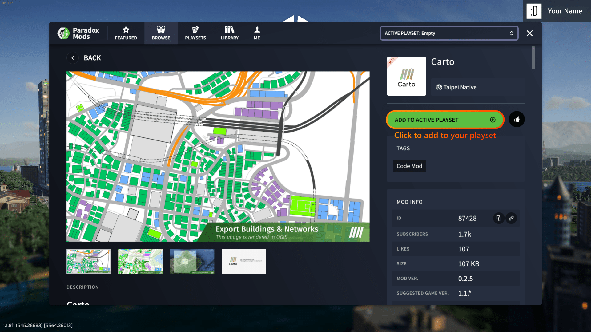
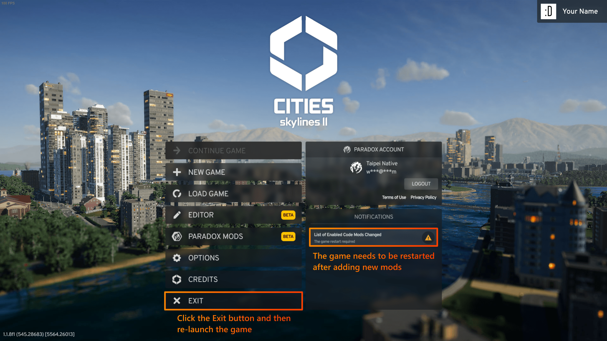
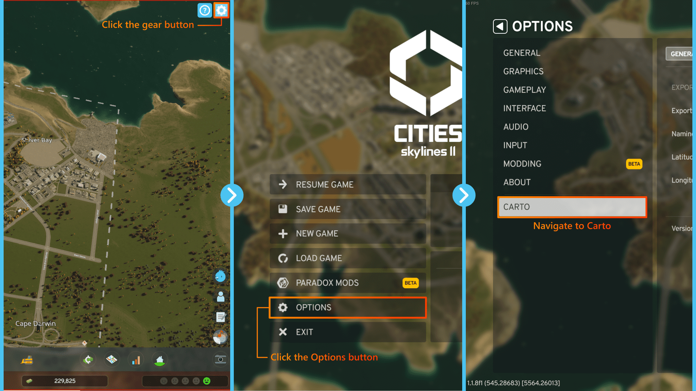
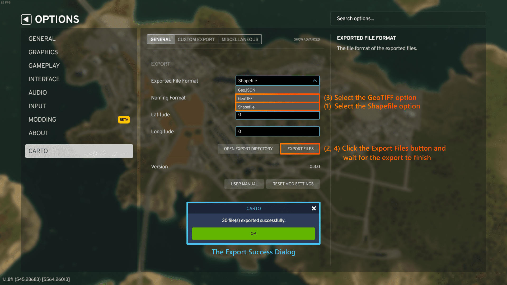
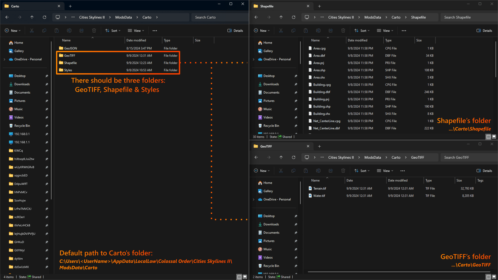

This is the step-by-step tutorial of using Carto & QGIS to make a beautiful map of your city. Please refer to the [[main manual|Home]] for all technical details.

這是一份使用 Carto 和 QGIS 製作你的城市地圖的教學，**[[中文版教學由此進|Tutorial-zh]]**。

## Part I: Carto

### Installation

You can add the mod to your current playlist by searching “Carto” on the [Paradox Mods](https://mods.paradoxplaza.com/mods/87428/Windows) in-game or online (you have to log-in your Paradox account first); there’s a khaki-ish map image with the white background on the icon. After the mod is added, it is required to restart the game.

> **Figure 1**  
> *Click the “Add to Active Playset” button to add Carto to your game.*
> 

> **Figure 2**  
> *Restart the game after adding Carto.*
> 

### Exporting

Next, open the save you want to export when the game is ready. After the game finishes loading your save, click on the button with a gear icon (⚙️) on the top-right corner of the screen and then the button labeled as “Options”. Navigate to the option called “Carto” in the left sidebar.

> **Figure 3**  
> *Navigate to Carto’s options.*
> 

There many options you can configurate, but for now we will leave them as they are. (If you added the mod before the version 0.3, you shall reset your settings as there are some modifications on the default exporting fields, which will be used later in this tutorial) We only care about two options in this tutorial: the “Exported File Format” dropdown and the “Export” button. Please select the option “Shapefile” in the dropdown, and then hit the “Export” button. The export may take up to a minute, depending on your city size. After the export finishes, a dialog would inform you the export was successful. With the dropdown value set to “GeoTIFF”, please click the “Export” button again and wait until the export ended.

> **Figure 4**  
> *Steps to export the files.*
> 

Lastly, you can click the “Open Export Directory” button to reveal the location of the exported files (default to be `C:\Users\<UserName>\AppData\LocalLow\Colossal Order\Cities Skylines II\ModsData\Carto`), which will be used in QGIS soon.

> **Figure 5**  
> *The export directory revealed in the File Explorer.*
> 

## Part II: QGIS

### Download & Installation

You can visit [QGIS’s official website](https://www.qgis.org/download/) to obtain the binary installer. In order to complete the tutorial, you shall install the version no prior than 3.28 'Firenze', and I recommend you to download the latest long term release (LTR) version, which is more stable (As of September 2024, the LTR version is 3.34 'Prizren'). After you download the installer, you can install the program by following the install wizard’s instruction. If you encounter any problem when downloading / installing QGIS, please refer to the article provided by QGIS: [FAQ](https://www.qgis.org/resources/support/faq/) & [Installation Guide](https://www.qgis.org/resources/installation-guide/).
